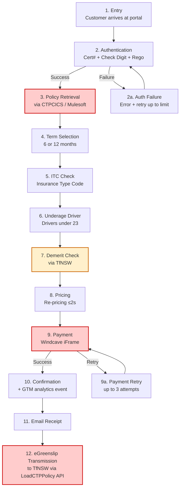
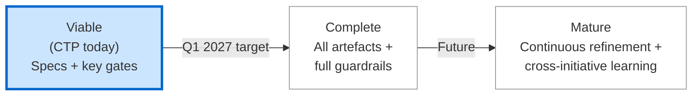

# CTP Online Uplift — Spec-Driven Delivery Case Study

**Status:** Draft — Pilot in flight  
**Initiative:** CVS-471 · CTP Online Uplift  
**Product Owner:** Liz Elliott  
**Business Sponsors:** Linda Veltman, Huw Owen  
**Squad:** Rockstars / Nirvana  
**Timeline:** March 2026 → June 2027  
**Aligned to:** AI-Assisted Spec-Driven Delivery — QBE Framework v0.1

---

## Table of contents

1. Executive Summary
2. Scope & Applicability
3. Microsoft SDD Alignment
4. QBE Governance Extensions
5. Governing Principles
6. Agent Architecture
7. Workflow Stages
8. Methodology Adapter
9. Roles & Accountabilities
10. Artefact Catalogue
11. Compliance & Audit Controls
12. Guardrails
13. Maturity Position
14. Metrics & Assurance
15. Governance Cadence
16. Adoption Journey
17. Glossary
18. References & Change Log

Alignment Appendix — How this case study maps to the framework

---

## 1. Executive Summary

**Who this is for:** Anyone with a stake in CTP Online Uplift — the Rockstars / Nirvana squad delivering it, the business owners sponsoring it (Linda Veltman, Huw Owen), the Product Owner (Liz Elliott), and reviewers from internal audit, the Architecture Review Board (ARB) and the Group AI Office.

**What you'll do here:** Read this once for the picture of what CTP Online Uplift is doing, why it was chosen as the pilot for the QBE AI-Assisted Spec-Driven Delivery framework, and where the initiative sits today.

### The initiative in brief

CTP Online Uplift is QBE's programme to modernise the way customers buy and renew Compulsory Third Party (CTP) motor insurance in New South Wales. CTP is the mandatory insurance every NSW vehicle owner needs in order to register their car.

Today QBE sells and renews CTP through several online portals, each serving a different kind of customer:

- **NSW Motorists** buying or renewing directly through QBE's website (the Direct Online portal, often shortened to "DOL")
- **Agents** transacting on behalf of customers through the Agent Online portal ("AOL")
- **Fleet customers** managing multiple vehicles through the Fleet Online portal ("FOL")
- **QBE Staff** supporting customers who phone in or visit in person
- **Partner** organisations that distribute QBE CTP under their own arrangements

Each portal has its own variant of what is, at heart, the same underlying renewal and new-business journey. CTP Online Uplift is improving that journey across all five.

The Epic (Jira reference CVS-471) is owned by Liz Elliott as Product Owner. Linda Veltman and Huw Owen are the business sponsors. The Rockstars / Nirvana squad is delivering the work from March 2026 through to June 2027.

### Why the initiative matters

The business case sits in the conversion data — the percentage of customers who finish a quote or a renewal and actually buy the policy:

- Customers on **mobile devices** buying a new policy (Quote-to-Buy) are completing at **36.88%**
- Customers on **mobile devices** renewing an existing policy (Renewal-to-Buy) are completing at **67.01%**
- Customers on **desktop computers** renewing an existing policy are completing at **84.17%**

The seventeen-point gap between mobile and desktop renewal completion is the headline issue. Mobile traffic has been growing year on year, and that gap represents premium income QBE isn't capturing on the device most customers are reaching for.

Testing during the design phase already showed a **4.29% improvement at the Payment step** and a **3.99% improvement at the Confirmation step** when the renewal flow was refined. The hypothesis is validated; what remains is to deliver those improvements consistently and at scale, while keeping the regulatory exposure managed properly.

That regulatory exposure is significant. The renewal flow:

- Handles credit card payment data, which falls under **PCI DSS** (Payment Card Industry Data Security Standard, set by the global card networks)
- Transmits a digital CTP certificate, called an **eGreenslip**, to **Transport for NSW (TfNSW)** — the state regulator — when a policy is issued or renewed
- Handles personal information, which falls under the **Privacy Act** and the Australian Privacy Principles
- Runs on a platform subject to the **APRA prudential standards** — CPS 234 for information security and CPS 230 for operational risk management

### Why CTP is the pilot for the framework

CTP was chosen as the pilot for the AI-Assisted Spec-Driven Delivery framework because it lets the framework prove itself against a real, regulated, multi-portal programme without being unmanageable. It has the kind of complexity QBE's platforms deal with day to day — five different customer journeys, integrations with several internal and external systems, payment processing subject to PCI DSS — while being scoped tightly enough that the first release can be delivered, measured and learned from inside the framework's first year. The conversion data makes it visible enough that the framework's contribution can actually be observed.

### How the framework is being applied

The framework runs an 8-stage workflow that takes a business idea from its original document through to a released change. The CTP team has worked through the early stages already:

- **PRD Ingestion is complete.** The CTP Product Requirements Document (PRD) — the document the business writes to capture what it wants built and why — has been converted into a structured Ingestion Pack covering the seven feature groupings, the five customer personas, the non-functional requirements (performance, availability, security and so on), the list of systems involved, and the known risks.

- **Specify is underway** for the first Minimum Viable Product (MVP) — the smallest version of the change that delivers real customer value. The MVP covers the Direct Customer Renewal flow and condenses the 25-step PRD diagram into 12 essential steps.

- **Risk classification** of those specifications has identified three **higher-risk** steps that will go through the Architecture Review Board:
  - **Policy Retrieval** — looking up the customer's existing policy. This depends on **CTPCICS**, QBE's legacy CTP policy management system, reached through **Mulesoft** as the integration layer.
  - **Payment** — taking the customer's payment for the policy. This uses **Windcave**, a payment gateway, embedded as a small frame inside the QBE page. Windcave handles the card data itself so QBE's systems don't have to — which is what keeps the PCI DSS scope workable.
  - **eGreenslip Transmission** — sending the digital CTP certificate to TfNSW once payment has succeeded, through TfNSW's **LoadCTPPolicy** API.

  One further step, the **Demerit Check** (a regulatory lookup of the customer's driving record through TfNSW), is **medium-risk** and goes through Technical Lead review.

- The **Compliance Footprint** — the metadata that records which regulatory obligations each piece of work touches — is being populated against PCI DSS, the Privacy Act, APRA CPS 234, CPS 230 and the NSW state regulatory obligations.

- The **Initiative Constitution** — the document that captures the rules of engagement for this specific initiative — is drafted and committed to the repository.

### Where the initiative sits today

CTP Online Uplift is at the **Viable** maturity position. Viable is the first of three stages in the framework's Maturity Position model (the others being Complete and Mature). At Viable, the minimum artefact set is in place but not every part of the fuller framework is operating yet.

For CTP, what's in place is the Initiative Constitution, the PRD Ingestion Pack, Feature Specs in draft, Risk Classification applied to each spec, the Compliance Footprint, and the Risk Gate operating for the first set of specifications. What isn't yet in operation includes the full set of automated guardrails (the technical checks that run on AI output), the Knowledge Agent (the framework's context-retrieval agent) and the complete set of agent authority tier assignments. These are expected gaps at the Viable stage and are being tracked against the Maturity Position model.

The first MVP release for Direct Customer Renewal is targeted for **Q3 2026**. The New Business flow begins Specify in **Q4 2026**. The aim is for the initiative to reach **Complete maturity by Q1 2027** and operate at that position for the remainder of the programme.

### How to read this document

This case study mirrors the structure of the AI-Assisted Spec-Driven Delivery framework. Each section here corresponds to a section in the framework, describing how CTP applies it. If you're not yet familiar with the framework's concepts — terms like Initiative Constitution, Compliance Footprint, Risk Gate, Maturity Position — refer to the framework document for definitions and the broader picture. This page focuses on the CTP-specific application and the evidence it has produced. The Alignment Appendix at the end maps every section here back to the corresponding section in the framework.

---

## 2. Scope & Applicability

**Who this is for:** Anyone needing to know which parts of CTP Online Uplift fall inside this case study's coverage, and which are out of scope for the current MVP.

**What you'll do here:** See the boundary of what's being built first, what's coming later, and what's deliberately not part of the programme.

### What's in scope for the current MVP

The first MVP of CTP Online Uplift covers the **Direct Customer Renewal flow** — an NSW Motorist using QBE's Direct Online portal (DOL) to renew their existing CTP policy. This is one of seven functional groupings in the PRD, chosen as the MVP because it's the highest-volume journey and the largest source of measurable conversion uplift.

The MVP scope includes the 12 essential steps from the original 25-step PRD renewal flow diagram, covering everything from the customer arriving at the portal through to the eGreenslip being transmitted to TfNSW.

### What's coming after the MVP

The remaining six functional groupings — Direct New Business, Agent flows (AOL), Fleet flows (FOL), QBE Staff flows, Partner flows, and the supporting administrative functions — are scheduled to follow once the MVP has been released, measured and learned from. The Direct New Business flow is the next to enter Specify, in Q4 2026.

### What's explicitly out of scope (Non-MVP)

A few items have been called out in the PRD as deliberately not part of the MVP scope, and the spec set reflects those exclusions:

- **Alternative authentication methods** — the MVP supports only the primary authentication using Certificate Number, Check Digit and vehicle registration. Other authentication approaches stay with the existing portal for now.
- **AMEX card payments** — the MVP supports Visa and Mastercard via Windcave. AMEX is out of scope for the first release.
- **Cross-portal experiences** — the MVP doesn't add cross-channel features beyond what already exists today.

These exclusions are recorded in the PRD Ingestion Pack and carried forward as out-of-scope markers in the Feature Specs.

### Evidence captured

The scope position is recorded in the PRD Ingestion Pack, which names the seven functional groupings, marks the MVP one as in-scope and the remaining six as planned, and lists the deliberate exclusions. Each Feature Spec for the MVP references the relevant groupings from the Pack and inherits the out-of-scope markers.

---

## 3. Microsoft SDD Alignment

**Who this is for:** Anyone wanting to see how the five phases of Microsoft Spec-Driven Development have been applied to CTP Online Uplift.

**What you'll do here:** Walk through each phase as it has played out (or is playing out) for CTP, with the actual artefacts and the status of each.

### Constitution (complete)

CTP has both layers of Constitution in place:

- The **QBE Organisation Constitution** applies as the baseline — permitted AI tools, data classification rules, baseline compliance controls and architectural standards QBE-wide.
- The **CTP Initiative Constitution** has been drafted and committed to the initiative repository. It captures the rules specific to CTP — the in-scope APIs (CTPCICS via Mulesoft, Windcave for payment, TfNSW LoadCTPPolicy for eGreenslip), the higher compliance controls that apply because the platform handles regulated data, and the architectural patterns the squad is expected to follow.

### Specify (in flight)

The Specify phase is currently producing the Feature Specs and User Story Specs for the Direct Customer Renewal MVP:

- **Feature Specs** are being authored for the 12-step MVP journey, each describing one logical feature of the renewal flow with acceptance criteria in EARS notation
- **User Story Specs** are being decomposed from the Feature Specs, scoped to single iterations
- The **Compliance Footprint** is being populated against each spec
- The **Risk Classification** is being applied as each spec completes — three higher-risk and one medium-risk so far

The Business Analyst on the Rockstars / Nirvana squad owns this phase and is reviewing each AI-drafted spec before it advances.

### Plan (pending higher-risk gate)

Plan starts after the Risk Gate has approved each spec. For CTP, the three higher-risk specs are queued for ARB review. Once approved, the Architect will produce:

- **Technical Design Documents** for each Feature, covering integration with CTPCICS, Windcave and TfNSW
- **Architecture Decision Records** for choices significant enough to capture — for example, the chosen approach to Windcave iFrame embedding and PCI DSS scope minimisation

### Tasks (pending Plan)

The Plan will be decomposed into Task Specs and Test Specs, each scoped to single iteration commitments. Test Specs are authored before any implementation begins.

### Implement (pending Tasks)

Implementation will run under the framework's Agent Authority Model. The Implementation Agent will generate code drafts from Task and Test Specs; the Developer reviews, refines and merges. Most CTP implementation will run at Tier B (Advisory) authority, with the higher-risk specs running at Tier C (Restricted) until the team has built confidence in the AI output for those particular flows.

### Evidence captured

Each phase produces named artefacts in the initiative repository: Organisation Constitution reference, CTP Initiative Constitution, PRD Ingestion Pack, Feature Specs, User Story Specs, Risk Classifications, and (pending) Technical Design Documents, ADRs, Task Specs, Test Specs and Change Records. The status of each is recorded in the Initiative Constitution's progress register.

---

## 4. QBE Governance Extensions

**Who this is for:** Reviewers checking how the three QBE governance extensions are operating on CTP.

**What you'll do here:** See each extension applied — PRD Ingestion, the Risk-Tiered Approval Gates, and Compliance Traceability — with the actual CTP-specific evidence.

### PRD Ingestion

The CTP PRD has been converted into a structured Ingestion Pack covering:

- A **feature inventory** of the seven functional groupings (A–G) from the PRD, with the MVP scope marked
- A **persona matrix** for the five customer journeys (NSW Motorists, Agents, Fleet customers, QBE Staff, Partners)
- An **NFR register** covering 99.9% availability (RTO ≤4h), page load ≤1s, re-pricing ≤2s, policy retrieval ≤3s, PCI DSS controls, TLS, 24-month audit log retention, WCAG 2.1 accessibility, and real-time application and API health monitoring
- A **risk register** of the 10 risks called out in the PRD, including the CTPCICS dependency, the Windcave PCI DSS scope, and the TfNSW transmission obligation
- An **integrations list** of the 14 systems involved, internal and external
- An **out-of-scope boundary** capturing the Non-MVP items (alternative authentication, AMEX, etc.)

The Pack is owned by the Business Analyst and was reviewed by Liz Elliott (Product Owner) and the Compliance & Security Lead before being committed to the repository.

### Risk-Tiered Approval Gates

The Risk Classification has been applied to each MVP spec, with the following results:

| Spec | Risk Tier | Routed to | Reasoning |
|---|---|---|---|
| Policy Retrieval (Step 3) | **Higher** | ARB | CTPCICS legacy system dependency; failure has broad blast radius |
| Demerit Check (Step 7) | **Medium** | Technical Lead | TfNSW regulatory dependency, but failure path is well-understood and has a documented fallback |
| Payment (Step 9) | **Higher** | ARB | Windcave integration handles card data — PCI DSS scope and failure mode both material |
| eGreenslip Transmission (Step 12) | **Higher** | ARB | Regulated transmission to TfNSW; failure means customer doesn't get a valid CTP certificate |
| Other MVP steps | **Lower** | Automated guardrails | Stay within established patterns; no sensitive data; no novel risk |

The three higher-risk specs are queued for the next standing ARB session. The medium-risk spec is queued for Technical Lead review in the same week.

### Compliance Traceability

The Compliance Footprint on each MVP spec covers the obligations relevant to the work that spec touches. For the CTP MVP, the obligations in play are APRA CPS 234 and CPS 230 (across the whole MVP, because all of it runs on regulated QBE platforms), PCI DSS (Payment specs), the Privacy Act and Australian Privacy Principles (most specs, given the policy and driver details involved), and NSW state CTP regulations (Demerit Check and eGreenslip transmission specifically).

The Compliance & Security Lead reviews the Footprint at each gate and confirms it's accurate before sign-off.

### Evidence captured

The three extension artefacts for CTP are the PRD Ingestion Pack (in the repository), the Risk Classification recorded on each spec (in spec metadata), and the Compliance Footprint travelling with each spec (in spec metadata, with version history).

---

## 5. Governing Principles

**Who this is for:** Anyone reviewing how CTP's day-to-day work is aligned with the framework's governing principles.

**What you'll do here:** See each of the five principles in concrete application on CTP.

### Principle 1 — Specifications and decisions are the source of truth

The CTP repository holds the Feature Specs, User Story Specs and the (forthcoming) ADRs as the authoritative record of the MVP. When a question arises about an acceptance criterion or a design choice, the squad's first reference is the spec or the ADR — not the Slack thread or the meeting notes.

### Principle 2 — Humans author, AI assists

Every CTP spec is reviewed and signed off by the Business Analyst on the Rockstars / Nirvana squad. The AI-drafted specs are typically 60-80% of the way to acceptable on first pass, with the BA making refinements and adding context the AI couldn't surface from the PRD alone.

### Principle 3 — Traceability and compliance travel with the work

Each MVP spec carries its Compliance Footprint forward as it moves through the workflow. When the eGreenslip transmission spec eventually reaches its Change Record, the regulatory obligations it touches will all be visible in the same audit chain, alongside the spec it implements, the design that shaped it, and the people who approved each step.

### Principle 4 — Risk determines the gate

The four higher- and medium-risk specs are queued for ARB or Technical Lead review. The remaining MVP specs are running under automated guardrails. The volume of ARB time CTP consumes is therefore proportional to its actual risk, not to a one-size-fits-all process.

### Principle 5 — Adoption is progressive

CTP started at Viable and is targeting Complete maturity by Q1 2027. The fuller framework — full automated guardrails, Knowledge Agent integration, the complete authority tier set — is being layered on as the squad gains familiarity, not imposed all at once.

### Evidence captured

Principle alignment is evident in the spec artefacts, the gate approvals, the Compliance Footprint and the Maturity Position record — all available in the initiative repository.

---

## 6. Agent Architecture

**Who this is for:** Anyone wanting to know which AI agents are operating on CTP, and how the team works with them.

**What you'll do here:** See the CTP-specific agent configuration, the human counterparts and the agent authority tiers in use.

### Agents configured for CTP

CTP uses all seven agents from the framework's architecture, but the Knowledge Agent is in light use during Viable — fuller integration is one of the criteria for moving to Complete.

| Agent | CTP human counterpart | Current authority tier | Notes |
|---|---|---|---|
| PRD Ingestion Agent | Business Analyst (Rockstars / Nirvana) | Tier B — Advisory | Used to produce the CTP PRD Ingestion Pack |
| Specification Agent | Business Analyst | Tier B — Advisory | Producing Feature and User Story Specs from the Ingestion Pack |
| Architect Agent | Squad Architect | Tier B — Advisory (Tier C for higher-risk specs) | Will draft Technical Design Documents once Risk Gate clears |
| Implementation Agent | Squad Developers | Tier B by default; **Tier C — Restricted** for the three higher-risk specs (Payment, eGreenslip, Policy Retrieval) | Awaiting Plan to complete |
| Critic Agent | Squad Technical Lead | Tier B — Advisory | Reviewing draft specs and (later) draft implementations |
| Compliance & Security Agent | Compliance & Security Lead | Tier B — Advisory | Reviewing and maintaining the Compliance Footprint |
| Knowledge Agent | Light use during Viable | Tier A — Autonomous | Will move to active use as part of the move to Complete maturity |

### Why Tier C for the higher-risk specs

The CTP Initiative Constitution sets the Implementation Agent's authority at Tier C (Restricted, meaning the human reviewer confirms each step before the next) for the three higher-risk MVP specs. This is more cautious than the default Tier B and reflects the regulated nature of those flows. It's a position the squad expects to revisit once they've completed a release cycle and built confidence in the AI output for those specific patterns.

### Evidence captured

The agent configuration, the human counterparts and the authority tier assignments are all recorded in the CTP Initiative Constitution. Agent run logs are stored in the initiative's log store and reviewable at any gate.

---

## 7. Workflow Stages

**Who this is for:** Anyone tracking CTP's progress through the framework's 8-stage workflow.

**What you'll do here:** See the status of each workflow stage for CTP, and the actual CTP-specific 12-step renewal flow that the workflow is being applied to.

### Where CTP is in the workflow

| Stage | Status | Notes |
|---|---|---|
| 1. Constitution Setup | ✅ Complete | Organisation and Initiative Constitutions committed |
| 2. PRD Ingestion | ✅ Complete | Ingestion Pack reviewed by PO and committed |
| 3. Specify | 🔄 In flight | Feature Specs being drafted; User Story Specs in progress |
| Risk Gate | 🔄 In flight | 3 higher-risk and 1 medium-risk spec queued for review |
| 4. Plan | ⏳ Pending Risk Gate | Architect ready to start once gates clear |
| 5. Tasks | ⏳ Pending Plan | — |
| 6. Implement | ⏳ Pending Tasks | — |
| 7. Verify | ⏳ Pending Implement | — |
| 8. Release | ⏳ Pending Verify | Target Q3 2026 for first MVP release |

### The 12-step CTP Renewal Flow (MVP)

The Direct Customer Renewal MVP condenses the 25-step PRD renewal flow into 12 essential steps. The diagram below shows the flow with the higher-risk steps (red) and the medium-risk step (amber) highlighted. All other steps run under the framework's automated guardrails.

### Feedback loop

CTP is at the start of the workflow, so the feedback loop hasn't yet activated. Once the first MVP release goes through Verify and Release in Q3 2026, learnings from the released change will inform the next pass through Specify for the New Business flow.

### Evidence captured

The progress status is recorded against the CTP Initiative Constitution and updated as each stage advances. The 12-step Renewal Flow diagram lives in the initiative repository as part of the Feature Spec documentation. The Risk Gate queue is visible in spec metadata.

---

## 8. Methodology Adapter

**Who this is for:** Anyone needing to understand how CTP runs the SDD workflow inside its delivery methodology.

**What you'll do here:** See how the SDD stages map to the Rockstars / Nirvana squad's actual cadence.

### CTP runs in SAFe Agile

The Rockstars / Nirvana squad operates as part of QBE's SAFe Agile structure, with 2-week iterations inside 8-week Program Increments (PIs). The SDD stages slot into this rhythm rather than replacing any of it.

| SDD Stage | CTP's SAFe Agile cadence |
|---|---|
| 1. Constitution Setup | Initiative kickoff (March 2026), ahead of PI 1 |
| 2. PRD Ingestion | First weeks of PI 1, before story refinement |
| 3. Specify | Feature Specs during PI prep; User Story Specs in the iteration before they're built |
| Risk Gate | Higher-risk specs reviewed by ARB during PI prep; medium-risk during iteration refinement |
| 4. Plan | Iteration Planning, with input from the ART System Architect |
| 5. Tasks | Within the iteration, alongside refinement |
| 6. Implement | Iteration execution (2-week sprints) |
| 7. Verify | Iteration Definition of Done, System Demo at iteration end |
| 8. Release | On-demand release or at PI boundary, depending on what's ready |

### CTP-specific cadence notes

- The squad uses Inspect & Adapt at each PI boundary as the moment to feed learnings back into the spec library. The first Inspect & Adapt with framework learnings is expected at the end of PI 2.
- The IP iteration at PI boundary is when the squad consolidates the Compliance Footprint position across all the work released in that PI and reviews it with the Compliance & Security Lead.

### Evidence captured

The methodology in use is recorded in the CTP Initiative Constitution, so reviewers and auditors reading the artefacts know to interpret them against the SAFe Agile cadence rather than a Waterfall phase structure.

---

## 9. Roles & Accountabilities

**Who this is for:** Anyone needing to know who's accountable for what on CTP.

**What you'll do here:** See the named role-holders for the initiative and the squad.

### Initiative-level roles

| Role | Person | Accountability |
|---|---|---|
| Product Owner | Liz Elliott | Owns the Epic, prioritises features, signs off business outcomes |
| Business Sponsors | Linda Veltman, Huw Owen | Sponsor the initiative, hold the business case |
| Engineering Lead | TBC | Accountable for the squad's overall adherence to the framework |
| Architect | TBC | Owns the Plan artefacts and the risk classification |
| Compliance & Security Lead | TBC | Owns the Compliance Footprint across all stages |

### Squad-level roles (Rockstars / Nirvana)

The Rockstars / Nirvana squad includes the standard delivery roles. Real names against each will be confirmed in the next Initiative Constitution refresh:

- **Business Analyst** — owns the PRD Ingestion Pack, Feature Specs, User Story Specs
- **Technical Lead** — oversees task breakdown and code review
- **Developers** — generate code under the Implementation Agent; review and merge
- **Quality Engineer** — authors Test Specs, executes verification
- **DevSecOps Engineer** — handles deployment and release controls

### Evidence captured

The role-holder list is recorded in the CTP Initiative Constitution and is updated at each Maturity Review (every six months). Each artefact carries the name of its accountable role-holder at the moment of sign-off, providing the audit trail of who owned what.

---

## 10. Artefact Catalogue

**Who this is for:** Reviewers checking which framework artefacts exist for CTP and where they are.

**What you'll do here:** See the catalogue of CTP artefacts and the current status of each.

### Current artefact set

| Artefact | Status | Location |
|---|---|---|
| Organisation Constitution (reference) | ✅ Referenced | Central framework repository |
| CTP Initiative Constitution | ✅ Committed | Initiative repository, `/constitution/` |
| PRD Ingestion Pack | ✅ Committed and reviewed | Initiative repository, `/ingestion/` |
| Feature Specs (MVP) | 🔄 Drafted | Initiative repository, `/specs/features/` |
| User Story Specs (MVP) | 🔄 In progress | Initiative repository, `/specs/stories/` |
| Risk Classifications | 🔄 Applied per spec | Spec metadata |
| Compliance Footprints | 🔄 Populated per spec | Spec metadata |
| Technical Design Documents | ⏳ Pending Risk Gate | — |
| Architecture Decision Records | ⏳ Pending Plan | — |
| Task Specs | ⏳ Pending Plan | — |
| Test Specs | ⏳ Pending Plan | — |
| Code, automated tests, deployment configuration | ⏳ Pending Implement | — |
| Test Results | ⏳ Pending Verify | — |
| Compliance Sign-off | ⏳ Pending Verify | — |
| Change Record (first MVP release) | ⏳ Target Q3 2026 | — |
| Agent Run Logs | ✅ Active | Initiative log store |

### Evidence captured

The artefact catalogue itself is the evidence — its presence and status against the framework's expectations is reviewable from the repository at any time.

---

## 11. Compliance & Audit Controls

**Who this is for:** Compliance & Security Lead, internal audit, the Group AI Office, and anyone reviewing CTP's compliance posture.

**What you'll do here:** See the regulatory obligations CTP touches and how each is being addressed through the framework's Compliance Footprint.

### Obligations CTP touches

| Obligation | Where it applies in CTP | How CTP addresses it |
|---|---|---|
| **APRA CPS 234** (Information Security) | All MVP steps — the whole platform handles regulated data | Footprint records data assets, controls applied and accountable people on every spec |
| **APRA CPS 230** (Operational Risk Management) | All MVP steps — CTP is part of QBE's critical operational footprint in NSW | Risk Classification records platform criticality; operational tolerances tied to the Footprint |
| **PCI DSS** | Step 9 (Payment via Windcave) and Step 9a (Payment Retry) | Windcave handles card data, so QBE's PCI DSS scope is minimised to the iFrame integration. Higher-risk classification routes the spec to ARB. |
| **Privacy Act and Australian Privacy Principles** | Most MVP steps — customer details, driver details, vehicle details | Personal data flows recorded in the Footprint; relevant APPs applied; data subject impacts called out in Feature Specs |
| **NSW state CTP regulations** | Step 7 (Demerit Check via TfNSW) and Step 12 (eGreenslip Transmission) | TfNSW dependencies recorded in Initiative Constitution; transmission failure paths defined; fallback for Demerit Check captured |

### Control points across CTP's workflow

The framework's control points are operating for CTP as follows:

- **Constitution Setup** — Initiative-level obligations declared in the CTP Initiative Constitution (✅)
- **PRD Ingestion** — Compliance-relevant flows identified in the Ingestion Pack (✅)
- **Specify** — Initial Compliance Footprint added to each MVP spec (🔄 in progress)
- **Risk Gate** — Higher-risk specs queued for ARB; compliance posture will be confirmed at review (🔄 pending ARB)
- **Plan onward** — pending earlier stages completing

### Where the detailed controls live

The mapping from each obligation to specific controls (for example, which PCI DSS requirements apply to the Windcave iFrame integration) sits in the **Compliance Control Mapping** companion document. The CTP-specific application of that mapping is recorded in the Compliance Footprint metadata on each spec.

### Evidence captured

For CTP specifically, the compliance evidence to date is the Initiative Constitution declaring the applicable obligations, the PRD Ingestion Pack identifying the compliance-relevant flows, and the Compliance Footprint being populated against the in-flight specs. The Compliance & Security Lead reviews this at each Risk Gate and ahead of each ARB session.

---

## 12. Guardrails

**Who this is for:** Reviewers checking the safety architecture around CTP's AI-assisted work.

**What you'll do here:** See which of the framework's four guardrail layers are operating on CTP, and which are still being built up.

### Status of each layer

| Layer | CTP status | Notes |
|---|---|---|
| **Layer 1 — Constitutional** | ✅ Operating | CTP Initiative Constitution included in every agent's prompt context |
| **Layer 2 — Specification** | 🔄 Operating in flight | Each spec's EARS-notation acceptance criteria, Compliance Footprint and Risk Classification serve as the constraints for downstream agent activity |
| **Layer 3 — Automated** | 🔄 Partial | Schema validators and basic content filters are in place; SAST scanning, deeper PII detection and Compliance Footprint schema enforcement are being built up as part of the move to Complete maturity |
| **Layer 4 — Human Review** | ✅ Operating at every gate | Spec Review (BA), Risk Gate (ARB or Tech Lead), and forthcoming gates (ADR Approval, Code Review, Compliance Sign-off, Change Record) all have named approvers |

### What's in the gap (Layer 3)

The Automated Guardrail layer is the main gap during Viable. What's running now: schema validation on AI-drafted spec outputs, and basic content filters.

What's being built up before Complete: Static Application Security Testing (SAST) on AI-generated code, Compliance Footprint schema validators rejecting incomplete metadata, personal information detectors blocking unredacted data appearing in agent output, and approved configuration pattern validators.

### Why this is acceptable at Viable

The framework's Maturity Position model allows Layer 3 to be partial at Viable, on the basis that the human review layer (Layer 4) is operating thoroughly. For CTP, the higher-risk specs are also running at Tier C agent authority — human in the loop on every step — which provides additional cover until the automated layer is fully built up.

### Evidence captured

The guardrail layer status is recorded against the CTP Initiative Constitution and is reviewed at each Maturity Review. Layer 1 evidence is the Constitution itself; Layer 2 evidence is the spec metadata; Layer 3 evidence is the running validator and scanner logs; Layer 4 evidence is the recorded gate approvals.

---

## 13. Maturity Position

**Who this is for:** Anyone tracking CTP's adoption progress against the framework.

**What you'll do here:** See where CTP currently sits in the maturity model and what the path forward looks like.

### Current and target position

CTP is at **Viable**. The target is to reach **Complete** by **Q1 2027**.

### What's in place at Viable (CTP)

- Organisation and CTP Initiative Constitutions committed
- PRD Ingestion Pack reviewed and committed
- Feature Specs and User Story Specs being authored
- Risk Classification applied to each spec
- Compliance Footprint populated against named obligations
- Risk Gate operating
- Human review at every named gate

### What needs to be in place for Complete

- Full automated guardrail suite (Layer 3) — currently partial
- Knowledge Agent in active use across the squad
- Agent authority tiers explicitly assigned per task type for every distinct task family
- ADRs being captured consistently for significant decisions
- All gates operating with named approvers and recorded sign-offs across the full workflow

### Path to Complete

- **Q3 2026** — first MVP release for Direct Customer Renewal completes the workflow end-to-end for the first time
- **Q4 2026** — automated guardrail suite built up; Knowledge Agent integration extended
- **Q1 2027** — Maturity Review confirms move to Complete

### Evidence captured

The current and target maturity positions are recorded in the CTP Initiative Constitution. The Maturity Review happens every six months, with the next review scheduled for Q3 2026 alongside the first MVP release.

---

## 14. Metrics & Assurance

**Who this is for:** Anyone tracking whether CTP's framework adoption and business outcomes are on the right trajectory.

**What you'll do here:** See the metrics being captured for CTP — both framework metrics and business outcome metrics.

### Business outcome metrics (the conversion KPIs)

| Metric | Baseline | Target | Source |
|---|---|---|---|
| Mobile Quote-to-Buy | 36.88% | TBC at MVP release | Existing analytics |
| Mobile Renewal-to-Buy | 67.01% | Close the gap to desktop | Existing analytics |
| Desktop Renewal-to-Buy | 84.17% | Maintain | Existing analytics |
| Payment step lift (A/B proven) | +4.29% | Realise at scale | A/B testing during design |
| Confirmation step lift (A/B proven) | +3.99% | Realise at scale | A/B testing during design |

The conversion data is the business case for the initiative, and each Feature Spec maps its acceptance criteria to one or more of these metrics. Principle 3 (Traceability) is what will allow the eventual conversion change to be attributed back to the specific specs and changes that produced it.

### Framework metrics

| Family | Metric | Current status |
|---|---|---|
| Adoption | Maturity position | Viable, target Complete by Q1 2027 |
| Process | Cycle time per stage | Being measured from PI 2 onward |
| Process | Risk Gate cycle time | Three higher-risk specs in queue; first ARB review expected within current PI |
| Quality | AI output acceptance rate on Feature Specs | First-pass acceptance ~60-80% (squad observation; formal tracking starts at PI 2) |
| Compliance | Footprint completeness | 100% of in-flight MVP specs have a populated Footprint |

### How CTP's metrics feed the framework view

CTP's metrics are reported at the squad's Maturity Review (every six months), which feeds the framework's quarterly assurance picture. As the pilot, CTP's experience is being watched closely — common stalls, gate cycle times and audit findings against CTP inform framework refinements before they're rolled out more widely.

### Evidence captured

The conversion baseline data is from the existing QBE analytics platform and recorded against the Feature Specs. Framework metrics are captured in the Initiative Constitution's progress register and reviewed at the Maturity Review.

---

## 15. Governance Cadence

**Who this is for:** Anyone working out when CTP's framework reviews and gates happen.

**What you'll do here:** See CTP's specific cadence for per-spec gates, maturity reviews and constitutional reviews.

### CTP's per-spec gates

| Gate | When it happens for CTP |
|---|---|
| Spec Review | At end of each Specify pass — BA signs off on AI-drafted specs before they move to Risk Classification |
| Risk Gate | At end of each Specify pass — higher-risk specs queued for next ARB; medium-risk to Technical Lead within the week |
| ARB approval | Standing weekly ARB sessions — CTP higher-risk specs are in the next two sessions |
| ADR approval | During Plan — will activate once Risk Gate clears for the three higher-risk specs |
| Tech Lead review | At Tasks — within iteration refinement |
| Code review | At Implement — within iteration execution |
| Compliance Sign-off | At Verify — Compliance & Security Lead, per release |
| Change Record approval | At Release — Engineering Lead, per release |

### CTP's Maturity Review

- **Frequency:** Every six months
- **Next review:** Q3 2026, alongside first MVP release
- **Attendees:** Engineering Lead, Architect, Compliance & Security Lead, Product Owner (Liz Elliott)
- **Output:** Updated Maturity Position, refreshed Initiative Constitution, learnings fed back to the framework owner

### CTP's Constitutional Review

The CTP Initiative Constitution is reviewed at the same six-month cadence as the Maturity Review, or earlier if a significant change in scope (for example when the New Business flow enters scope in Q4 2026) makes a refresh necessary.

### Evidence captured

The cadence is recorded in the CTP Initiative Constitution. Gate outcomes are stored in spec metadata. Maturity Review minutes and Constitutional Review minutes are committed to the initiative's governance space.

---

## 16. Adoption Journey

**Who this is for:** Other QBE initiatives considering adopting the framework, and anyone reflecting on how CTP's adoption has played out.

**What you'll do here:** Walk through the five steps of adoption as they happened for CTP, with the observations the team has captured along the way.

### How CTP adopted the framework

**Step 1 — Decision and declaration (March 2026).** The decision to adopt the framework was taken at CTP's initiative kickoff. Liz Elliott (Product Owner) and the Engineering Lead recorded the adoption decision in the initiative charter and notified the framework owner.

**Step 2 — Role appointments (March 2026).** The squad's standing roles — BA, Architect, Tech Lead, Developers, Quality Engineer, DevSecOps Engineer — were confirmed. A Compliance & Security Lead was appointed specifically for the initiative given its regulated nature. Each role completed the framework's persona orientation in the first two weeks.

**Step 3 — Initiative Constitution and repository setup (March–April 2026).** The Architect, supported by the Engineering Lead and Compliance & Security Lead, authored the CTP Initiative Constitution. The repository was set up with spec templates, the agent configurations and the link back to the Organisation Constitution. This step took longer than initially expected because CTP's regulated context required more careful articulation of the platform-specific guardrails — a useful learning to feed forward.

**Step 4 — Pilot feature walkthrough (April–May 2026).** The squad walked one feature — the Term Selection step from the Renewal Flow, chosen for its low risk and self-contained scope — through the full workflow as a learning exercise. The walkthrough surfaced practical issues around the Compliance Footprint schema and the way AI-drafted specs were referencing the PRD Ingestion Pack, both of which were addressed before scaling to the full MVP.

**Step 5 — Viable declaration (May 2026).** With the pilot feature complete and the artefact set in place, the Engineering Lead formally declared CTP at Viable maturity. The declaration was recorded in the Initiative Constitution and CTP joined the framework's quarterly assurance picture.

### Observations the team has captured

- **Step 3 is the most front-loaded.** The Initiative Constitution and repository setup needed more time than the squad expected, especially for the regulated controls articulation. The framework owner has fed this back into the Adoption Journey guidance for subsequent initiatives.
- **The pilot feature was the right thing to do.** Surfacing schema and reference issues on a low-risk feature before tackling the higher-risk specs saved meaningful rework.
- **Compliance involvement from day one.** Having the Compliance & Security Lead in Step 2 rather than later was important — the regulatory context drove several Initiative Constitution decisions that would have been painful to add after the fact.

### Evidence captured

The adoption journey is recorded against CTP in the Initiative Constitution's history, including the dates, the role-holders involved and the observations from the pilot feature walkthrough.

---

## 17. Glossary

**Who this is for:** Anyone reading this case study without prior CTP context.

**What you'll do here:** Find definitions for the CTP-specific terms used throughout the case study. For framework-level terms (Initiative Constitution, Compliance Footprint, Risk Gate, Maturity Position, etc.), refer to the framework's Glossary in Section 17 of the framework document.

**AOL (Agent Online).** The QBE portal used by agents transacting CTP on behalf of customers.

**CTP (Compulsory Third Party).** The mandatory motor insurance every NSW vehicle owner needs in order to register their car. Covers injury to other people if the policy-holder causes an accident.

**CTPCICS.** QBE's legacy CTP policy management system, holding existing CTP policy data. Accessed by the renewal flow through Mulesoft.

**CVS-471.** The Jira reference for the CTP Online Uplift Epic.

**DOL (Direct Online).** The QBE portal used by NSW Motorists transacting CTP directly.

**eGreenslip.** The digital version of the CTP certificate issued when a policy is bought or renewed. NSW law requires the eGreenslip to be lodged with Transport for NSW (TfNSW) for the vehicle to be considered insured for registration purposes.

**FOL (Fleet Online).** The QBE portal used by Fleet customers managing CTP across multiple vehicles.

**LoadCTPPolicy API.** The API exposed by TfNSW that QBE uses to transmit the eGreenslip to the regulator after a successful payment.

**MVP (Minimum Viable Product).** The smallest version of a change that delivers real customer value. CTP's first MVP is the Direct Customer Renewal flow.

**Mulesoft.** The integration platform QBE uses to expose legacy systems (like CTPCICS) through modern APIs to the customer-facing portals.

**PRD (Product Requirements Document).** The business-authored document that captures what's wanted from a change, why it matters, and what success looks like. For CTP, the PRD is the source for the PRD Ingestion Pack.

**Quote-to-Buy.** The conversion metric tracking customers who start a quote for a new CTP policy and complete the purchase.

**Renewal-to-Buy.** The conversion metric tracking customers who start a CTP renewal and complete the purchase.

**Rockstars / Nirvana.** The QBE squad delivering CTP Online Uplift.

**TfNSW (Transport for NSW).** The NSW state regulator responsible for vehicle registration. QBE transmits eGreenslips to TfNSW after a CTP policy is bought or renewed.

**Windcave.** The payment gateway QBE uses to handle credit card payments on the renewal flow. Embedded as an iFrame inside the QBE page. Handles the card data itself so QBE's systems remain outside the PCI DSS scope.

---

## 18. References & Change Log

**Who this is for:** Anyone wanting to trace this case study back to its sources or track how it has evolved over time.

### Internal references

- **CTP Online Uplift PRD** — the Product Requirements Document this case study is built on
- **Confluence Epic CVS-471** — the Jira / Confluence epic for CTP Online Uplift
- **CTP Initiative Constitution** — in the CTP initiative repository
- **CTP PRD Ingestion Pack** — in the CTP initiative repository
- **AI-Assisted Spec-Driven Delivery — QBE Framework v0.1** — the generic framework this case study mirrors

### External references

External references for regulations (APRA CPS 234, CPS 230, PCI DSS, Privacy Act) are listed in the framework document, Section 18.

### Change Log

| Version | Date | Summary |
|---|---|---|
| 0.1 | May 2026 | Initial draft of the case study, covering the Direct Customer Renewal MVP. Status: Viable maturity; in flight at Specify and Risk Gate stages. |

---

## Alignment Appendix — How this case study maps to the framework

Every section of this case study corresponds to a section of the AI-Assisted Spec-Driven Delivery framework. The mapping is one-to-one, with the same numbering.

| Case study section | Framework section | Relationship |
|---|---|---|
| 1. Executive Summary | 1. Executive Summary | CTP-specific Exec Summary |
| 2. Scope & Applicability | 2. Scope & Applicability | CTP's specific scope and exclusions |
| 3. Microsoft SDD Alignment | 3. Microsoft SDD Alignment | CTP's status against each SDD phase |
| 4. QBE Governance Extensions | 4. QBE Governance Extensions | The three extensions applied to CTP |
| 5. Governing Principles | 5. Governing Principles | How each principle shows up on CTP |
| 6. Agent Architecture | 6. Agent Architecture | CTP-specific agent configuration |
| 7. Workflow Stages | 7. Workflow Stages | CTP's progress; 12-step Renewal Flow diagram |
| 8. Methodology Adapter | 8. Methodology Adapters | CTP runs in SAFe Agile — the relevant mapping |
| 9. Roles & Accountabilities | 9. Roles & Accountabilities | Named role-holders for CTP |
| 10. Artefact Catalogue | 10. Artefact Catalogue | The CTP artefact set, with status per artefact |
| 11. Compliance & Audit Controls | 11. Compliance & Audit Controls | Obligations CTP touches and how each is addressed |
| 12. Guardrails | 12. Guardrails | Status of the four layers for CTP |
| 13. Maturity Position | 13. Maturity Position Model | CTP at Viable, target Complete Q1 2027 |
| 14. Metrics & Assurance | 14. Metrics & Assurance | CTP's conversion baselines and framework metrics |
| 15. Governance Cadence | 15. Governance Cadence | CTP's specific cadences inside SAFe Agile |
| 16. Adoption Journey | 16. Adoption Journey | How CTP adopted, with observations captured |
| 17. Glossary | 17. Glossary | CTP-specific terms; framework terms remain in framework |
| 18. References & Change Log | 18. References & Change Log | CTP-specific references; framework references stay there |
