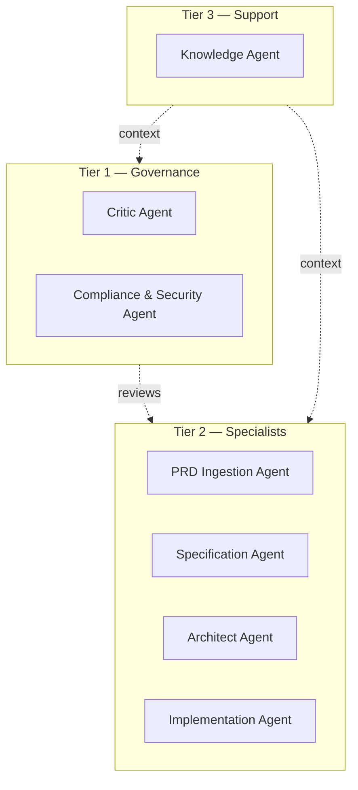
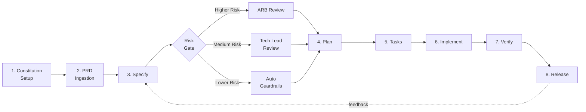
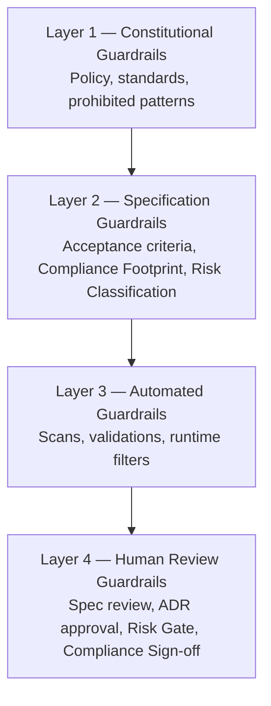
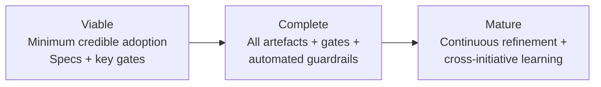

# AI-Assisted Spec-Driven Delivery — QBE Framework

**Status:** Draft  
**Owner:** TBC  
**Next Review:** TBC  
**Version:** 0.1  
**Aligned to:** Microsoft Spec-Driven Development (GitHub Spec Kit)

---

## Table of contents

1. Executive Summary
2. Scope & Applicability
3. Microsoft SDD Alignment
4. QBE Governance Extensions
5. Governing Principles
6. Agent Architecture
7. Workflow Stages
8. Methodology Adapters — SAFe Agile and Waterfall
9. Roles & Accountabilities
10. Artefact Catalogue
11. Compliance & Audit Controls
12. Guardrails
13. Maturity Position Model
14. Metrics & Assurance
15. Governance Cadence
16. Adoption Journey
17. Glossary
18. References & Change Log

---

## 1. Executive Summary

**Who this is for:** Anyone with a hand in how software gets built at QBE. That includes Business Analysts, Architects, Developers, Quality Engineers, DevSecOps Engineers, Project Managers and Scrum Masters, along with the Product Owners and Engineering Leads who sponsor their work.

**What you'll do here:** Read this section once so you know what AI-Assisted Spec-Driven Delivery means at QBE, who it applies to, and how it sits alongside whatever delivery methodology your initiative already uses.

### Purpose

This framework sets out how QBE delivers software now that AI agents are part of the team. AI helps across most of the lifecycle today: drafting specifications, reviewing designs, generating code, writing tests, and checking that compliance obligations are being met. The framework is built on **Microsoft's Spec-Driven Development (SDD)** model — Constitution, Specify, Plan, Tasks, Implement — and extends it to fit the kind of regulated environment QBE operates in.

The specification is the source of truth in this framework. When there's ambiguity later about what was built or why, the spec is the document everyone returns to. Anything an AI produces should be traceable back to a spec a human has authored, and every spec should carry the evidence needed to show alignment with QBE's obligations under APRA CPS 234, CPS 230, PCI DSS and the Privacy Act.

### What this framework gives you

- A shared way of talking about spec-driven work across QBE, so people in different platforms and squads describe the same things the same way
- A defined 8-stage workflow that takes you from a PRD through to production
- An agent architecture that sets clear limits on what AI can do on its own and where a human or the Architecture Review Board needs to step in
- Methodology adapters so the same workflow can run inside SAFe Agile or a Waterfall delivery without changing the underlying spec model
- A maturity model that lets you adopt progressively (Viable, then Complete, then Mature) rather than taking it all on at once
- An audit trail that holds up under APRA, internal audit and external assurance reviews, without having to reconstruct evidence after the fact

### Where this framework fits

This framework is designed to work alongside whatever delivery methodology your initiative already uses — SAFe Agile, Kanban, Waterfall, or a hybrid of these. Its scope is deliberately narrow: it covers how specifications are authored, reviewed and enforced when AI is part of the work, and leaves everything else with your existing approach. Team structure, sprint cadence and ceremonies remain the responsibility of whichever delivery method your squad already knows well. Think of this as an additional layer that sits across your delivery method, adding the spec-driven and AI-governance dimensions on top of what you already do.

### Microsoft SDD alignment

QBE takes the Microsoft SDD core sequence — Constitution, Specify, Plan, Tasks, Implement — as it is, with no changes to the underlying flow. What QBE adds is three governance extensions that wrap around the core:

- **PRD Ingestion** — a stage that sits before Specify and turns business-authored PRDs into the kind of structured input the spec workflow can pick up cleanly
- **Risk-Tiered Approval Gates** — higher-risk specifications need ARB approval, medium-risk specifications go through a technical lead, and lower-risk work runs against automated guardrails
- **Compliance Traceability** — each spec, plan and task carries its compliance footprint as it moves through the workflow, so the evidence is being captured along the way rather than pulled together when an audit lands

These extensions are additive rather than mandatory. An initiative that's only adopted the Microsoft SDD core is still aligned with this framework — full adoption simply layers the governance on top.

### How to read this document

Read top to bottom on first pass. After that, the table of contents is the easiest way to come back to your role's quick-card in Section 9 and the workflow stage you're working in (Section 7). The Methodology Adapters in Section 8 show how the framework runs inside SAFe Agile or Waterfall, so pick whichever one applies to your initiative. If you're getting ready to adopt the framework on a new initiative, the Adoption Journey in Section 16 walks through the onboarding sequence step by step.

---

## 2. Scope & Applicability

**Who this is for:** Anyone working out whether this framework applies to their initiative — Engineering Leads, Architects, Product Owners and Programme Managers making that call before delivery work starts.

**What you'll do here:** Read this to know whether your initiative falls inside this framework's scope, and what your obligations look like if it does.

### When this framework applies

This framework applies to any QBE software delivery initiative where AI agents take part in the work, whether that's a single Copilot-assisted feature in a long-running squad or a full agentic delivery model running across several platforms. The trigger is the presence of AI in producing artefacts that matter to the business: specifications, designs, code, tests, configuration or compliance evidence. If AI is touching any of these, the work sits inside this framework.

The framework applies across QBE's regulated platforms (Underwriting, Claims, CCM, Integration, Digital) as well as internal-only tooling. The depth of the governance layer scales with risk and regulatory exposure — Section 11 covers how that scaling works in practice.

### What sits with other frameworks

A few areas are deliberately left for QBE's existing policies and frameworks to govern, and this framework is designed to work on top of them:

- **AI tooling approval and procurement** — decisions about which AI tools are sanctioned for use at QBE sit with the Group AI Office and Information Security. This framework assumes those choices have been made and that the tools in use are approved.
- **Data classification and handling** — what data may be sent to which AI service is covered by QBE's existing Information Security policies. This framework points to them rather than restating them.
- **Workforce and people policy on AI** — training, role design and the people-related implications of AI assistance sit with People & Culture.

The intent is for this framework to slot in cleanly alongside those policies, focusing on the delivery activity itself.

### How adoption is decided

For new initiatives using AI assistance, this framework is the default expectation. The adoption decision is made at initiative kickoff, owned jointly by the Engineering Lead and the Product Owner, and recorded in the initiative's governance artefacts.

For initiatives already in flight at the point this framework is published, adoption can be phased through the Maturity Position model in Section 13, starting at Viable and progressing toward Complete and Mature as the team builds familiarity.

Exemptions, where genuinely needed, are requested through the Architecture Review Board with clear reasoning attached. The expectation is that exemptions are rare and time-bounded.

### Evidence captured

The decision to adopt this framework is recorded in the initiative's kickoff governance artefact (initiative charter or equivalent), with the Engineering Lead and Product Owner named as accountable parties. Exemption requests are captured by the Architecture Review Board, with reasoning and review date documented at the point of approval.

---

## 3. Microsoft SDD Alignment

**Who this is for:** Anyone needing to understand how QBE's framework maps onto the Microsoft Spec-Driven Development model — particularly Engineering Leads, Architects and Specification Engineers establishing the workflow for their initiative.

**What you'll do here:** Walk through the five phases of Microsoft SDD as QBE applies them, so you know what each phase produces, who owns it, and where AI participates.

### The Microsoft SDD core sequence

Microsoft's Spec-Driven Development model is built around a five-phase sequence: **Constitution, Specify, Plan, Tasks, Implement**. Each phase produces a defined artefact that becomes the input to the next, and the whole sequence is designed so that AI agents can participate meaningfully while humans retain authorship and approval of the work that matters.

QBE adopts this core sequence as it stands. What follows is a phase-by-phase view of what each one means in a QBE context.

### Constitution

In Microsoft SDD, the constitution is the document that tells AI agents the rules of engagement before any specification work begins. It captures the conventions to follow, the patterns to avoid, the frameworks to prefer and the boundaries an initiative needs to stay within.

QBE applies this at two levels. There is an **Organisation Constitution** that applies across all initiatives, covering things like permitted AI tools, data classification rules, baseline compliance controls and required architectural patterns. On top of that, each initiative authors an **Initiative Constitution** that tightens the rules for its own context — which APIs are in scope, what platform-specific guardrails apply, and any controls that lift above the baseline because of risk or regulatory exposure.

Both constitutions are checked into the initiative's repository so they travel with the code and are available to every AI agent participating in the work.

### Specify

The Specify phase converts business intent into a structured specification that the rest of the workflow can act on. It describes what the change is and why it matters, without yet prescribing how it will be built.

In a QBE initiative, the Specify phase is fed by the PRD Ingestion stage that sits just ahead of it (see Section 4). What enters Specify is a structured set of inputs already prepared from the source PRD; what leaves is a set of **Feature Specs and User Story Specs** written in EARS notation, with acceptance criteria, a compliance footprint and a risk classification attached.

AI agents typically draft the initial specs from the ingested PRD inputs. The Business Analyst is the human owner who reviews, refines and signs off on each spec before it advances.

### Plan

Plan is where the technical approach is decided for each specification. It covers the design, the integration points, the data flows, the controls and the decisions that will shape the implementation.

In QBE, the Plan artefacts are a **Technical Design Document** for each Feature and **Architecture Decision Records** for the choices significant enough to need a durable record. The Plan also carries the risk classification forward — higher-risk plans go to the Architecture Review Board for approval, medium-risk plans need a Technical Lead sign-off, and lower-risk plans run against the automated guardrails described in Section 12.

AI agents support the Architect by drafting design options, surfacing integration considerations and proposing ADRs. The Architect curates and decides; the AI doesn't get the casting vote.

### Tasks

Tasks decompose the Plan into discrete units of implementable work, each small enough to be tested and reviewed in its own right. Each task carries the spec and compliance traceability forward, so by the time work is in flight, every piece of code being written is connected back to a specific acceptance criterion.

QBE's Task artefacts are **Task Specs and Test Specs**, paired together. The Test Spec is authored before implementation begins, which is the Spec-Driven Development principle in its most practical form: you can only build something correctly if you can describe what correctness looks like first.

AI agents commonly produce the initial decomposition and draft the test specs from the acceptance criteria. The Tech Lead validates the breakdown, and Quality Engineers review the test specs before implementation starts.

### Implement

Implement is where the code, tests and deployment artefacts are produced, working from the spec and within the constraints set by the constitution.

In QBE, this phase runs under the **Agent Authority Model** described in Section 6, which sets explicit limits on what AI can produce on its own, what needs human review before merge, and what needs ARB sign-off before going to production. The artefacts produced are the working code, the automated tests, the deployment configuration and the **Change Record** that ties the released change back through Tasks, Plan, Spec and Constitution.

The Developer remains the author of record for the code, regardless of how much of it was AI-generated. AI accelerates the work, but accountability for what gets merged stays with the human.

### Evidence captured

Each phase produces named artefacts that are committed to the initiative's repository: Organisation and Initiative Constitutions, Feature and User Story Specs, Technical Design Documents and ADRs, Task and Test Specs, and Change Records. Together they form the audit trail from business intent through to production change, captured as work progresses rather than reconstructed later.

---

## 4. QBE Governance Extensions

**Who this is for:** Engineering Leads, Architects, Specification Engineers, Compliance & Security Leads, and anyone configuring the workflow for an initiative — these extensions are the QBE-specific layer that wraps the Microsoft SDD core.

**What you'll do here:** Understand the three governance extensions QBE adds to Microsoft SDD, how they work in practice, and which artefacts each one produces.

### Why these extensions exist

Microsoft SDD gives QBE the core mechanism for spec-driven, AI-assisted delivery. What it doesn't address on its own is the regulated environment QBE operates in — the APRA obligations, the PCI DSS controls, the audit expectations that come with running a major insurer. The three governance extensions below close that gap, sitting around the Microsoft SDD core rather than replacing any part of it.

### Extension 1 — PRD Ingestion

PRD Ingestion is a stage that sits before the Specify phase. Its job is to take a business-authored Product Requirements Document — which may sit in Confluence, a Word document, a Jira epic, or some combination of these — and convert it into a structured input the spec workflow can pick up cleanly.

Without this stage, the Specify phase ends up either consuming a free-form PRD directly (which produces inconsistent specs depending on how the PRD was written) or relying on each Business Analyst to do the structuring work informally. PRD Ingestion makes the structuring step a defined activity with a consistent output that's easier to review and reuse.

The Business Analyst owns this stage, supported by an AI agent that drafts an initial pass at structuring the PRD. The output is a **PRD Ingestion Pack** that includes:

- A feature inventory — the discrete features the PRD describes
- A persona matrix — who uses what, and through which channel
- A non-functional requirements register — performance, availability, security, accessibility, monitoring
- A risk register — known risks called out in the PRD
- An out-of-scope boundary — what the PRD explicitly excludes
- An integrations list — the upstream and downstream systems involved

This pack becomes the input to Specify. It also serves as a useful artefact in its own right for Product Owners and sponsors who want to understand what's been ingested before specifications are written.

### Extension 2 — Risk-Tiered Approval Gates

Not all specifications need the same level of scrutiny. A change to the way an internal admin screen displays a date is not the same kind of change as one that touches how customer payments are processed. The Risk-Tiered Approval Gates layer scales the review intensity to match the risk of the change.

Each specification is classified at the end of the Specify phase against three tiers:

- **Higher-risk** specifications go to the Architecture Review Board for approval. These typically touch payment flows, customer data, regulated transmissions to external bodies, or core platform components with broad blast radius.
- **Medium-risk** specifications go through the Technical Lead. These change behaviour in regulated platforms but stay within established patterns and controls.
- **Lower-risk** specifications proceed under automated guardrails alone. These stay inside well-understood patterns, don't touch sensitive data, and don't change the risk profile of the platform.

Classification is proposed by the Architect with AI assistance to flag the criteria, and confirmed at the gate review. A specification can be re-classified upward if review reveals risk that wasn't obvious from the surface description, but it cannot be re-classified downward without ARB endorsement.

The detailed criteria for each tier are maintained in the **Risk Classification Standard**, published alongside this framework. The standard covers data sensitivity, customer impact, regulatory exposure, financial materiality and platform criticality, with worked examples for each tier.

### Extension 3 — Compliance Traceability

The third extension is the one that does the most work at audit time. Every specification, plan and task carries a **Compliance Footprint** — metadata that identifies which obligations the work touches: APRA CPS 234 information security, CPS 230 operational risk, PCI DSS payment controls, the Privacy Act, and any other framework relevant to the initiative.

The footprint is added at Specify time, carried forward through Plan and Tasks, and consolidated in the Change Record at Implementation. The result is a traceable line from a regulated obligation through to the specific change that addresses it, available at any point without having to reconstruct evidence after the fact.

The Compliance & Security Lead owns the footprint, with AI assistance to flag obligations that may have been missed and to keep the metadata schema consistent across initiatives. The footprint is reviewed at each approval gate alongside the specification itself.

### Evidence captured

Each extension produces durable artefacts: the PRD Ingestion Pack at the start of a feature cycle, the Risk Classification recorded against each specification, and the Compliance Footprint travelling with every spec, plan, task and Change Record. Together with the Microsoft SDD core artefacts described in Section 3, they form the complete audit trail QBE relies on for assurance reviews.

---

## 5. Governing Principles

**Who this is for:** Everyone who participates in spec-driven delivery at QBE. These principles are the standing rules of engagement and they apply to all initiatives that fall inside this framework.

**What you'll do here:** Read these five principles once and come back to them when judgement calls come up that aren't covered explicitly elsewhere in this document.

### Principle 1 — Specifications and decisions are the source of truth

Two artefacts carry the authoritative record of an initiative: the specification, which describes what is being built and why, and the Architecture Decision Record, which captures significant choices at the moment they are taken. Code, tickets and conversations all play a role in delivery, but they aren't the authoritative record themselves. When there's disagreement later about what was meant to be built or why a particular path was chosen, these are the documents everyone returns to. They earn that status by being recorded when they're current — at the time the work is specified and at the moment a decision is made — rather than reconstructed from memory after the fact.

### Principle 2 — Humans author, AI assists

AI agents are excellent at drafting, proposing options, surfacing patterns and accelerating work, but they are not the authors of QBE's specifications, designs or decisions. Every specification, plan, architecture decision and change record has a named human owner who has reviewed the work, agrees with it, and is accountable for it.

### Principle 3 — Traceability and compliance travel with the work

The chain from PRD through Specify, Plan, Tasks, Implement and Change Record stays unbroken, with each artefact referencing the one before it. Travelling alongside is the Compliance Footprint, which identifies which obligations the work touches and which controls apply. Both are built into the specification from the start rather than added later in a separate workstream. This is what allows QBE to produce audit evidence as a natural byproduct of delivery, rather than reconstructing it after the fact when an assurance review lands.

### Principle 4 — Risk determines the gate

Scrutiny is proportional to risk. A small, low-impact change moves through automated guardrails without holding anyone up. A higher-risk change with broader blast radius or regulatory exposure passes through heavier review — Technical Lead approval or, where the criteria are met, the Architecture Review Board. Risk classification is decided at the end of Specify and recorded with the spec.

### Principle 5 — Adoption is progressive

No initiative is expected to adopt this framework completely on day one. The Maturity Position model in Section 13 sets out three stages — Viable, Complete and Mature — and initiatives are encouraged to move through them at a pace that fits their context. What matters is that adoption is deliberate and recorded, with the initiative actively moving toward fuller adoption rather than sitting still.

### Evidence captured

These principles aren't standalone artefacts in their own right, but their application is evidenced through every other artefact this framework produces — specifications, ADRs, Change Records, gate approvals and compliance footprints. An initiative's alignment with these principles is reviewable through the artefacts it produces, not by separate attestation.

---

## 6. Agent Architecture

**Who this is for:** Engineering Leads, Architects, Specification Engineers, and anyone configuring or operating the AI agents inside an initiative.

**What you'll do here:** Understand the seven agents the framework recognises, the three tiers they sit in, and the four levels of authority that govern what they can do without human involvement.

### The three tiers

The agents are organised into three tiers based on the role they play in delivery work.

**Tier 1 — Governance.** The Critic and Compliance & Security agents sit here. Their job is to review and challenge work produced by the specialist tier and to keep compliance obligations visible at every step.

**Tier 2 — Specialists.** The PRD Ingestion, Specification, Architect and Implementation agents do the bulk of the SDLC phase work. They draft, propose and generate, always under human review before anything is committed.

**Tier 3 — Support.** The Knowledge Agent is the single agent in this tier. Its job is to curate and supply context to the other agents — repository content, historical decisions, related specifications and organisational standards — so that work happens against a current and consistent picture.

### The seven agents

Each agent has a defined role, a named human counterpart, and a clear set of outputs it produces.

**PRD Ingestion Agent.** Reads the business-authored PRD and produces the PRD Ingestion Pack described in Section 4. Human counterpart: Business Analyst.

**Specification Agent.** Drafts Feature Specs and User Story Specs from the ingested PRD inputs, using EARS notation and the QBE spec template. Human counterpart: Business Analyst.

**Architect Agent.** Drafts Technical Design Documents and proposes Architecture Decision Records during the Plan phase. Surfaces integration options, controls and risk considerations. Human counterpart: Architect.

**Implementation Agent.** Generates code, tests and deployment artefacts from Task and Test Specs. Operates within the Plan and Constitution constraints. Human counterpart: Developer.

**Critic Agent.** Reviews artefacts produced by the specialist tier — looking for inconsistencies, missing acceptance criteria, gaps in test coverage and drift from the Constitution. Human counterpart: Technical Lead.

**Compliance & Security Agent.** Maintains and reviews the Compliance Footprint across every artefact. Flags missing obligations, inconsistent controls and changes that affect the risk classification. Human counterpart: Compliance & Security Lead.

**Knowledge Agent.** Retrieves and supplies relevant context to the other agents — existing specifications, prior ADRs, organisational standards, code patterns and integration documentation. It doesn't produce primary artefacts itself; its job is to support the agents that do.

### The authority model

Authority describes what each agent can do without explicit human action. It's set per task type rather than per agent, because the same agent might operate at different authority levels depending on what it's doing.

| Authority Tier | What the AI does | What the human does | Example tasks |
|---|---|---|---|
| **Tier A — Autonomous** | Acts alone and logs the result | Reviews periodically for assurance | Knowledge retrieval, format normalisation, repository searches |
| **Tier B — Advisory** | Drafts and proposes | Reviews and approves before the work is committed | Drafting specs, generating code, proposing ADRs |
| **Tier C — Restricted** | Generates with the human in the loop at each step | Confirms every step before the next is taken | Higher-risk plan revisions, changes to controls, modifications to specifications already in production |
| **Tier D — Prohibited** | Does not perform | Owns the action entirely | ARB approvals, sign-off on compliance evidence, downward changes to risk classification |

The default for new agent activity is Tier B. Movement to Tier A requires evidence that the activity is consistently low-risk and reviewable in retrospect. Movement to Tier C or D is decided by the Architecture Review Board on the basis of risk and regulatory exposure.

### Evidence captured

Each agent run produces logs that record what went in, what came out and which prompts were used. These logs are stored against the initiative and reviewable at any approval gate. Authority Tier assignments are recorded in the Initiative Constitution and revisited at each maturity review.

---

## 7. Workflow Stages

**Who this is for:** Anyone involved in moving work through the delivery cycle — Business Analysts, Architects, Developers, Quality Engineers, DevSecOps Engineers, Technical Leads and Product Owners.

**What you'll do here:** Walk through the eight stages of the QBE Spec-Driven Delivery workflow, understanding what each stage produces, who owns it, and how the work flows from a PRD through to a released change.

### The 8-stage workflow

The workflow has two parts. The first stage (Constitution Setup) happens once at initiative kickoff. The remaining seven stages form a cycle that repeats for each specification, from PRD Ingestion through to Release.

### Stage 1 — Constitution Setup

Happens once at the start of an initiative. The Engineering Lead and Architect, with input from the Compliance & Security Lead, author the Initiative Constitution — the document that captures initiative-specific rules of engagement on top of the Organisation Constitution.

- **Artefact produced:** Initiative Constitution (committed to the initiative repository)
- **Owner:** Engineering Lead
- **AI involvement:** Knowledge Agent supplies relevant patterns and prior constitutions from comparable initiatives

### Stage 2 — PRD Ingestion

The PRD Ingestion Agent reads the business-authored PRD and produces a structured PRD Ingestion Pack. The Business Analyst reviews and confirms the pack before it advances to Specify.

- **Artefact produced:** PRD Ingestion Pack
- **Owner:** Business Analyst
- **AI involvement:** PRD Ingestion Agent (Tier B — Advisory)

### Stage 3 — Specify

Each feature in the PRD Ingestion Pack is converted into a Feature Spec, then into one or more User Story Specs. The Specification Agent drafts each spec in EARS notation, populates acceptance criteria from the source PRD, and attaches the initial Compliance Footprint. The Business Analyst reviews and signs off.

At the end of Specify, each spec is risk-classified by the Architect with input from the Compliance & Security Lead. The classification determines which gate the spec passes through next.

- **Artefacts produced:** Feature Specs, User Story Specs, Risk Classification
- **Owner:** Business Analyst (spec); Architect (risk classification)
- **AI involvement:** Specification Agent (Tier B); Compliance & Security Agent (Tier B for classification input)

### Risk Gate

Each spec passes through one of three gates based on its classification. Higher-risk specs go to the Architecture Review Board for approval before Plan begins, medium-risk specs go through the Technical Lead, and lower-risk specs proceed under the automated guardrails described in Section 12.

The gate is a pause point. Plan doesn't begin until the appropriate approval is recorded.

### Stage 4 — Plan

The Architect Agent drafts a Technical Design Document for each Feature and proposes Architecture Decision Records for the choices that need a durable record. The Architect curates the options, decides on the path forward and signs off. The Compliance & Security Agent updates the Compliance Footprint to reflect the technical approach.

- **Artefacts produced:** Technical Design Document, Architecture Decision Records, updated Compliance Footprint
- **Owner:** Architect
- **AI involvement:** Architect Agent (Tier B); Critic Agent (Tier B for review)

### Stage 5 — Tasks

The Plan is decomposed into discrete tasks, each paired with a Test Spec authored before implementation begins. The Specification Agent and Critic Agent collaborate on the breakdown; the Technical Lead and Quality Engineer review.

- **Artefacts produced:** Task Specs, Test Specs
- **Owner:** Technical Lead (task breakdown); Quality Engineer (test specs)
- **AI involvement:** Specification Agent (Tier B); Critic Agent (Tier B)

### Stage 6 — Implement

The Implementation Agent generates code, automated tests and deployment configuration against each Task and Test Spec. The Developer reviews the generated code, refines what needs work, and merges when satisfied. The Compliance & Security Agent verifies that the Compliance Footprint is reflected in the implementation.

- **Artefacts produced:** Code, tests, deployment configuration
- **Owner:** Developer
- **AI involvement:** Implementation Agent (Tier B); Compliance & Security Agent (Tier B for verification)

### Stage 7 — Verify

Verification runs the full suite of tests defined in the Test Specs against the implemented change. The Critic Agent reviews for drift from the spec, missing test coverage and inconsistencies with the Plan. The Compliance & Security Lead reviews the final Compliance Footprint and confirms it matches the change.

- **Artefacts produced:** Test results, Compliance Sign-off
- **Owner:** Quality Engineer (test execution); Compliance & Security Lead (sign-off)
- **AI involvement:** Critic Agent (Tier B); Compliance & Security Agent (Tier B)

### Stage 8 — Release

The change is deployed into the target environment under the existing QBE release controls. The Change Record is finalised, linking back through Tasks, Plan, Spec, PRD Ingestion Pack and the relevant Constitution. The audit trail for this change is now complete and stored against the initiative.

- **Artefacts produced:** Change Record, deployment artefacts
- **Owner:** DevSecOps Engineer (deployment); Engineering Lead (Change Record sign-off)
- **AI involvement:** Knowledge Agent (Tier A — Autonomous, for retrieving prior change records and patterns)

### The feedback loop

After Release, learnings flow back into the workflow. Drift between the spec and the eventual implementation, gaps in the test specs and any compliance footprint adjustments are captured and inform the next pass through Specify on related work. The intent is that the spec library grows in quality over time as the framework matures.

### Evidence captured

Each stage produces named artefacts committed to the initiative's repository: Initiative Constitution, PRD Ingestion Pack, Feature and User Story Specs with Risk Classification, Technical Design Documents and ADRs, Task and Test Specs, Code with automated test results, Compliance Sign-off and the final Change Record. Together they form the unbroken chain from business intent through to released change.

---

## 8. Methodology Adapters — SAFe Agile and Waterfall

**Who this is for:** Engineering Leads, Architects, Project Managers, Scrum Masters and Programme Managers configuring the SDD workflow inside an existing delivery methodology.

**What you'll do here:** See how the 8-stage QBE SDD workflow maps onto SAFe Agile and Waterfall delivery, and the practical adaptations each one calls for.

### Quick reference — how each stage maps

The same SDD stages run inside both delivery methodologies. What changes is the cadence, the ceremonies they intersect with, and the moments at which artefacts are reviewed.

| SDD Stage | SAFe Agile | Waterfall |
|---|---|---|
| 1. Constitution Setup | ART or initiative kickoff, before the first PI | Project Initiation phase |
| 2. PRD Ingestion | PI Planning preparation, per Epic or Feature | Early in the Requirements phase |
| 3. Specify | Feature specs during PI Planning prep; User Story specs during iteration refinement | Bulk of the Requirements phase |
| Risk Gate | System Architect review during PI prep; ARB for higher-risk Features | End of Requirements phase — formal stage gate |
| 4. Plan | Iteration Planning, with input from ART System Architect | Design phase (HLD followed by LLD) |
| 5. Tasks | Iteration refinement and task decomposition | Build phase planning / Work Breakdown Structure |
| 6. Implement | Iteration execution across 2-week sprints | Build phase |
| 7. Verify | Iteration Definition of Done, System Demo, Continuous Testing | Test phase — SIT, UAT, regression |
| 8. Release | On-demand release or end-of-PI release | Deploy phase and Post-Implementation Review |

### SDD inside SAFe Agile

In SAFe Agile, the QBE SDD workflow lives inside the existing PI and iteration rhythm rather than replacing any of it. The PI cadence sets the planning horizon, the iteration cadence sets the execution rhythm, and the SDD stages slot into both.

PI Planning becomes the natural moment for PRD Ingestion and the first pass of Specify on the Features in scope. Feature-level specs are produced during PI Planning preparation and reviewed at the event itself. Story-level specs are then refined during the iterations they'll be built in, typically a sprint ahead of implementation. Risk classification happens at the end of each Specify pass, so a higher-risk Feature goes through ARB during PI Planning prep rather than mid-iteration.

The phases of a SAFe iteration map onto SDD as follows. Iteration Planning combines Plan and Tasks for the stories committed to that iteration. Execution within the iteration covers Implement. Iteration-end activities (Definition of Done, System Demo, and the IP iteration where present) cover Verify, and release activities, whether on demand or at PI boundary, cover Release.

A few specifics worth noting for ARTs running this framework:

- Feature-level specs survive across multiple iterations; story-level specs are scoped to single iterations
- Architecture Decision Records are captured as they emerge during iteration work, not deferred to a separate architecture cadence
- The Compliance Footprint is consolidated at the IP iteration, where the cumulative compliance picture for the PI is reviewed
- Inspect & Adapt is the natural venue for feedback loop learnings to enter the spec library for future PIs

### SDD inside Waterfall

In Waterfall delivery, the QBE SDD workflow aligns naturally with the existing phase structure, with each phase gate becoming the moment when the corresponding SDD artefacts are signed off.

Project Initiation is when Constitution Setup happens — the Initiative Constitution is authored alongside the project charter. The Requirements phase is where PRD Ingestion and Specify do most of their work, with Feature Specs and User Story Specs authored and reviewed before the phase closes. Risk classification is recorded against each spec, and the Risk Gate sits at the end of the Requirements phase, where higher-risk specs go to ARB before Design begins.

The Design phase covers Plan, producing the Technical Design Documents and ADRs that the rest of the project will reference. Build covers Tasks at the start of the phase and Implement through the bulk of it. Test covers Verify, with the Test Specs authored during Tasks now driving the SIT and UAT cycles. Deploy and Post-Implementation Review cover Release.

A few specifics for Waterfall initiatives running this framework:

- Documentation discipline is already familiar to Waterfall teams, and the SDD artefacts replace much of what would have been written as separate requirements specifications, design documents and test plans
- The Risk Gate at the end of Requirements becomes the formal sign-off point for the whole specification set, not just per-spec
- The Compliance Footprint is reviewed at each phase gate, so by the time Test concludes the compliance evidence is comprehensive
- The feedback loop is captured during Post-Implementation Review and informs the spec library for future projects

### Evidence captured

Whichever methodology your initiative follows, the SDD artefacts themselves are the evidence. The mapping above describes when each artefact is produced and reviewed in your delivery rhythm. The Initiative Constitution records the methodology in use, so reviewers and auditors can read the framework artefacts against the correct cadence reference.

---

## 9. Roles & Accountabilities

**Who this is for:** Everyone working inside an initiative under this framework. Read your own persona's section closely and skim the others to understand how the work crosses role boundaries.

**What you'll do here:** See the accountability picture across the workflow stages and find the quick-card for your own role — what you own, which AI agent you work with most closely, and how your day-to-day work changes under SDD.

### Stage accountability across the workflow

Accountable is the role that owns the outcome and signs it off; responsible is the role doing the work, often alongside an AI agent; consulted is the role asked for input without owning delivery.

| Stage | Accountable | Responsible | Consulted |
|---|---|---|---|
| 1. Constitution Setup | Engineering Lead | Architect, Compliance & Security Lead | Product Owner |
| 2. PRD Ingestion | Business Analyst | Business Analyst, PRD Ingestion Agent | Product Owner, Architect |
| 3. Specify | Business Analyst | Business Analyst, Specification Agent | Architect, Compliance & Security Lead |
| Risk Gate | Architect | Architect, Compliance & Security Lead | ARB (for higher-risk specs) |
| 4. Plan | Architect | Architect, Architect Agent | Developer, Compliance & Security Lead |
| 5. Tasks | Architect or Technical Lead | Architect / Technical Lead, Quality Engineer, Specification Agent | Developer |
| 6. Implement | Developer | Developer, Implementation Agent | Architect / Technical Lead, Compliance & Security Lead |
| 7. Verify | Quality Engineer (testing); Compliance & Security Lead (sign-off) | Quality Engineer, Critic Agent | Developer, Architect |
| 8. Release | DevSecOps Engineer (deployment); Engineering Lead (Change Record sign-off) | DevSecOps Engineer | Project Manager, Scrum Master, Business Analyst |

In larger ARTs and programmes, the Architect and Technical Lead may be separate roles (cross-squad System Architect and within-squad Technical Lead). In smaller squads they often consolidate. The accountabilities above apply to whoever holds the relevant decision rights in your structure.

### Persona quick-cards

Each card shows the stages you're most active in, the AI agent you work with most closely, the artefacts you own, and what changes from how you may have worked before this framework.

**Business Analyst**  
*Primary stages:* PRD Ingestion, Specify, Risk Gate (consulted)  
*Agent counterpart:* PRD Ingestion Agent, Specification Agent  
*Artefacts owned:* PRD Ingestion Pack, Feature Specs, User Story Specs  
*What changes:* Your time shifts from producing specification documentation to reviewing AI-drafted versions of it. You're now the quality bar for whether a spec accurately captures business intent. EARS notation may be new and is worth investing time in early.

**Architect** *(or Technical Lead, depending on squad structure)*  
*Primary stages:* Constitution Setup, Risk Gate, Plan, Tasks  
*Agent counterpart:* Architect Agent, Critic Agent  
*Artefacts owned:* Initiative Constitution (jointly), Risk Classification, Technical Design Documents, ADRs, Task Spec oversight  
*What changes:* The Architect Agent will draft design options and ADR candidates for you to review. Your value moves further toward judgement and decision-making, away from drafting. Risk classification is now a formal step you own, with a recorded outcome.

**Developer**  
*Primary stages:* Implement  
*Agent counterpart:* Implementation Agent  
*Artefacts owned:* Code, automated tests, deployment configuration  
*What changes:* The Implementation Agent generates code drafts from Task and Test Specs. Your work is to review what's generated, refine what needs adjustment, and own what gets merged. Productivity rises, but accountability for what ships stays with you. The Test Specs authored in Stage 5 are now your specification for what the code must do.

**Quality Engineer**  
*Primary stages:* Tasks (Test Specs), Verify  
*Agent counterpart:* Critic Agent  
*Artefacts owned:* Test Specs, test results  
*What changes:* Test Specs are authored before implementation begins, in collaboration with the Specification and Critic Agents. Your work shifts forward in the cycle, into the design of how correctness will be proven, rather than testing what has already been built.

**DevSecOps Engineer**  
*Primary stages:* Release  
*Agent counterpart:* Knowledge Agent (for prior release patterns)  
*Artefacts owned:* Deployment artefacts, deployment configuration validation  
*What changes:* The Compliance Footprint reaches Release in a complete state, with sign-off already recorded. Your release work itself is largely unchanged, but the evidence you reference is now drawn from the SDD artefacts rather than assembled separately.

**Project Manager**  
*Primary stages:* All stages (planning, reporting, escalation)  
*Agent counterpart:* Knowledge Agent (for status retrieval)  
*Artefacts owned:* Programme reporting, dependency tracking, schedule  
*What changes:* Status visibility improves because each stage produces a named artefact with a clear owner. Reporting becomes a matter of pointing at the repository's state of completion rather than chasing teams for updates. Risk Gate timing becomes a planning input worth factoring into schedules.

**Scrum Master**  
*Primary stages:* All stages (facilitation, impediment removal)  
*Agent counterpart:* Knowledge Agent  
*Artefacts owned:* Facilitation of ceremonies, impediment log  
*What changes:* The artefact-driven cadence of SDD makes impediments easier to spot — a missing PRD Ingestion Pack or an unreviewed spec is a visible blocker. The Risk Gate sometimes introduces wait time between Specify and Plan, which is worth surfacing in retros early until the team adapts to it.

### Three roles that orbit the workflow

**Engineering Lead** sponsors the initiative, owns Constitution Setup and the final Change Record sign-off, and is accountable for the initiative's overall adherence to this framework. They're the escalation point for ARB decisions and the named owner of any exemptions.

**Compliance & Security Lead** is accountable for the Compliance Footprint across all stages. They review the footprint at each gate, sign off compliance evidence at Verify, and own the relationship with the Group AI Office and Information Security on any obligations specific to the initiative.

**Product Owner** sponsors the initiative from the business side, owns the source PRD, and is consulted at Constitution Setup, PRD Ingestion and significant decisions. The framework doesn't change the PO's role substantially, but a working knowledge of the artefact set helps the PO engage productively with spec reviews and risk classification.

### Evidence captured

The accountability picture is recorded against the initiative in two places: the Initiative Constitution (which names the role-holders for the duration of the initiative), and each artefact's metadata (which records the named accountable person at the moment the artefact is signed off). Together these provide the audit trail of who owned what, and when, throughout the work.

---

## 10. Artefact Catalogue

**Who this is for:** Anyone needing a complete picture of the artefacts this framework produces — Engineering Leads, Architects, Specification Engineers, internal audit, and anyone reviewing an initiative for adherence to the framework.

**What you'll do here:** Find every artefact the framework recognises, grouped by category, with its purpose, owner, where it lives, and how it relates to other artefacts.

### How the catalogue is organised

Artefacts fall into six categories. Each category covers a specific role in the workflow, from the standing rules of the initiative through to the final record of a released change.

- **Constitutional** — the standing rules and conventions
- **Specification** — what is being built and why
- **Design** — how it will be built
- **Implementation** — the building work itself
- **Verification & Release** — proof it works and the record of the change
- **Cross-cutting** — metadata and logs that travel alongside the named artefacts

### Constitutional artefacts

| Artefact | Purpose | Owner | Where it lives |
|---|---|---|---|
| **Organisation Constitution** | QBE-wide standing rules for AI-assisted delivery: permitted tools, data classification baseline, compliance defaults, architectural standards | Group Architecture, with the Group AI Office | Central repository, referenced by every initiative |
| **Initiative Constitution** | Initiative-specific rules layered on top of the Organisation Constitution: in-scope APIs, platform-specific guardrails, controls that lift above baseline | Engineering Lead, with Architect and Compliance & Security Lead | Initiative repository, alongside the code |

### Specification artefacts

| Artefact | Purpose | Owner | Where it lives |
|---|---|---|---|
| **PRD Ingestion Pack** | Structured conversion of the business-authored PRD into the inputs Specify needs: feature inventory, persona matrix, NFR register, risk register, integrations list, out-of-scope boundary | Business Analyst | Initiative repository, referenced by all downstream specs |
| **Feature Spec** | Description of a discrete feature: what it is, why it exists, who it serves, what it must do, what it must not do | Business Analyst | Initiative repository, one per feature in the PRD Ingestion Pack |
| **User Story Spec** | Decomposition of a Feature Spec into stories with acceptance criteria in EARS notation, suitable for an iteration or build cycle | Business Analyst | Initiative repository, one or more per Feature Spec |
| **Risk Classification** | Higher / medium / lower risk tier assigned to each spec, with reasoning | Architect, with Compliance & Security Lead | Recorded as metadata on the spec |

### Design artefacts

| Artefact | Purpose | Owner | Where it lives |
|---|---|---|---|
| **Technical Design Document** | The technical approach for delivering a Feature: design, integration points, data flows, controls | Architect | Initiative repository, one per Feature Spec |
| **Architecture Decision Record** | A durable record of a significant architectural or design decision: context, alternatives considered, decision taken, trade-offs accepted | Architect, with the people involved in the decision named | Initiative repository, one per significant decision |

### Implementation artefacts

| Artefact | Purpose | Owner | Where it lives |
|---|---|---|---|
| **Task Spec** | A discrete unit of implementable work derived from the Plan, with clear acceptance criteria and a Test Spec attached | Architect / Technical Lead | Initiative repository, one or more per User Story Spec |
| **Test Spec** | The description of how correctness will be proven for a Task: test cases, expected outcomes, edge conditions, non-functional checks | Quality Engineer | Initiative repository, paired with each Task Spec |
| **Code, tests, deployment configuration** | The built solution itself, produced against the Task and Test Specs | Developer | Initiative repository under standard source control |

### Verification & Release artefacts

| Artefact | Purpose | Owner | Where it lives |
|---|---|---|---|
| **Test Results** | The output of running the Test Specs against the implemented change | Quality Engineer | Initiative repository, linked to the Task Specs that produced them |
| **Compliance Sign-off** | The Compliance & Security Lead's confirmation that the Compliance Footprint is accurate and the change meets its obligations | Compliance & Security Lead | Recorded against the change, before Release |
| **Change Record** | The final record of a released change: what was released, what specs it satisfies, what risks were carried, who approved it | Engineering Lead | Initiative repository and the QBE Change Management system |

### Cross-cutting artefacts

| Artefact | Purpose | Owner | Where it lives |
|---|---|---|---|
| **Compliance Footprint** | Metadata identifying which obligations a piece of work touches (APRA CPS 234, CPS 230, PCI DSS, Privacy Act and any others), travelling with the spec, plan, task and change record | Compliance & Security Lead | Embedded as metadata in every spec, plan, task and change record |
| **Agent Run Logs** | A record of every AI agent execution: inputs, outputs, prompts and the human reviewer who approved the result | Engineering Lead (custodian) | Initiative log store, retained per QBE's record retention policy |

### How artefacts reference each other

Each artefact references the one immediately before it in the workflow:

- The PRD Ingestion Pack references the source PRD
- Feature Specs reference the Ingestion Pack
- User Story Specs reference the Feature Spec they decompose
- The Technical Design Document references the Feature Spec it serves
- ADRs reference the design they shaped
- Task Specs reference the User Story Spec they decompose
- Test Specs reference the Task Spec they verify
- The Change Record references everything that contributed to the released change

This is the chain that Section 5's Principle 3 (Traceability and compliance travel with the work) describes in action.

### Evidence captured

The artefact catalogue itself is the evidence. An initiative's adherence to this framework can be assessed by checking that the expected artefacts exist, are owned by the expected roles, and reference each other in the expected way. The Initiative Constitution declares which artefacts the initiative commits to producing — since the maturity model in Section 13 allows some artefacts to be optional at the Viable stage — and the actual artefact set in the repository should match that declaration.

---

## 11. Compliance & Audit Controls

**Who this is for:** Compliance & Security Leads, Engineering Leads, Architects, internal audit, and anyone reviewing an initiative's adherence to QBE's regulatory obligations.

**What you'll do here:** Understand the obligations this framework is designed to support, the control points across the workflow where compliance evidence is captured, and how audit can access that evidence at any point.

### Obligations the framework supports

QBE operates under several regulatory frameworks. This framework is designed to make the evidence of adherence accessible by design rather than collected retrospectively.

**APRA CPS 234 — Information Security.** The information security obligations applying to APRA-regulated entities, covering the identification of information assets, the roles and responsibilities for protecting them, the control framework around them, and the management of security incidents. The framework supports CPS 234 by capturing the data assets a change touches, the controls applied, and the people accountable, all as part of the Compliance Footprint on every spec, plan and change.

**APRA CPS 230 — Operational Risk Management.** Operational risk obligations covering critical operations, service provider arrangements, and tolerances for disruption. The framework supports CPS 230 by recording the criticality of the affected platforms in the Risk Classification, identifying service provider arrangements (including AI tooling) through the Initiative Constitution, and tying changes to operational tolerances through the Compliance Footprint.

**PCI DSS — Payment Card Industry Data Security Standard.** Applies wherever a change touches the handling of payment card data. The framework supports PCI DSS by flagging payment data flows during PRD Ingestion. The relevant controls are recorded in the Compliance Footprint, and specs touching payment flows are routed to higher-risk treatment by default.

**Privacy Act and Australian Privacy Principles.** Applies wherever a change touches personal information. Personal data flows are captured in the Compliance Footprint when they're first identified. The relevant Privacy Principles are applied to the affected change, and data subject impacts are recorded as part of the spec.

Other obligations relevant to a particular initiative — sector codes, contractual obligations to partners, internal policy beyond regulation — are added to the Compliance Footprint at Initiative Constitution time and treated the same way as the named obligations above.

### Control points across the workflow

Compliance evidence is captured at defined points across the workflow rather than at a single sign-off at the end.

| Stage | Control point | What's captured |
|---|---|---|
| 1. Constitution Setup | Initiative-level obligations declared | Which regulations apply, which baseline controls apply, who the Compliance & Security Lead is |
| 2. PRD Ingestion | Compliance-relevant flows identified | Data classifications, integration with regulated systems, payment flows, personal information flows |
| 3. Specify | Initial Compliance Footprint added to each spec | Obligations touched, controls expected to apply, risk indicators feeding classification |
| Risk Gate | Higher-risk specs reviewed by ARB | Compliance posture confirmed before significant work begins |
| 4. Plan | Footprint updated with the technical approach | Controls actually applied, ADRs covering compliance-affecting decisions |
| 6. Implement | Footprint verified against implementation | Code, tests and configuration reflect the controls described in Plan |
| 7. Verify | Compliance & Security Lead signs off | Footprint accurate, controls operating, evidence captured |
| 8. Release | Change Record consolidates evidence | Complete compliance trail from obligation to released change |

### What audit can retrieve at any point

Because the Compliance Footprint travels with the work and is captured as the work progresses, audit teams can pull a current compliance picture at any moment without asking the squad to assemble it on demand.

The retrievable views include:

- The complete chain from PRD through to Change Record for any released change
- The Risk Classification on any spec, with the criteria and the named approver
- The ADRs covering compliance-affecting decisions and the people who made them
- The Agent Run Logs showing what AI activity contributed to which artefacts, and which human reviewed each output
- The Compliance Footprint as it stood at any point in the workflow, with its version history

These views are available through the initiative repository and the standard QBE audit interfaces.

### Where the detailed control mappings live

This framework provides the structure for capturing compliance evidence. The detailed mapping from each obligation to specific controls, and from each control to the artefact fields that record it, is maintained separately in the **Compliance Control Mapping** document, published alongside this framework. The mapping is reviewed annually or whenever a regulatory obligation changes.

### The Compliance & Security Lead's role

The Compliance & Security Lead is accountable for the compliance posture of the initiative end to end. They are involved at every stage of the workflow rather than only at sign-off — reviewing the Footprint as it develops, flagging gaps before they reach a gate, and engaging the Group AI Office and Information Security where the initiative raises obligations beyond the baseline.

For an initiative without a dedicated Compliance & Security Lead, this accountability is held by the Engineering Lead with support from the central Compliance & Security function. The expectation is that any initiative classified as higher-risk has a dedicated lead.

### Evidence captured

Compliance evidence is the Compliance Footprint, the Risk Classification on each spec, the ADRs covering compliance-affecting decisions, the Agent Run Logs, the Compliance Sign-off at Verify, and the final Change Record. Together they form the unbroken audit trail from regulatory obligation through to released change.

---

## 12. Guardrails

**Who this is for:** Engineering Leads, Architects, Compliance & Security Leads, DevSecOps Engineers, and anyone configuring or maintaining the guardrails that keep AI-assisted work safe to ship.

**What you'll do here:** Understand the four layers of guardrails the framework relies on, what each layer catches, and how they work together to keep AI activity inside acceptable boundaries.

### The four layers

Guardrails work in layers, with each layer catching a different kind of problem. The intent is that no single layer carries the load on its own — defence in depth is what makes the architecture robust enough for the environment QBE operates in.

### Layer 1 — Constitutional guardrails

The Constitution sits in every agent's context. It's the layer that tells AI agents what's allowed before they generate anything.

- **What it does:** Sets the standing rules for AI activity — permitted tools, allowed data classifications, architectural patterns to follow and to avoid, and which integrations are out of scope without explicit approval.
- **Where it operates:** At the start of every agent interaction. The Constitution is included in the agent's prompt context for every run.
- **What it catches:** Generation outside the allowed scope — use of a prohibited library, generation against an out-of-scope API, attempts to handle data above the agent's permitted classification.
- **Owner:** Group Architecture for the Organisation Constitution; Engineering Lead for the Initiative Constitution.
- **Examples:** "All payment-related code must use the QBE Payment Gateway abstraction"; "No agent may generate code that calls external services not listed in the integrations register"; "All personal information must be classified before processing."

### Layer 2 — Specification guardrails

The specification carries the constraints for a particular piece of work. It tells the AI what is being built, what success looks like, and what compliance and risk attributes apply.

- **What it does:** Defines acceptance criteria in EARS notation, attaches the Compliance Footprint, records the Risk Classification, and identifies the personas and edge conditions the implementation must handle.
- **Where it operates:** Throughout the Plan, Tasks and Implement stages. Each AI generation references the spec it serves.
- **What it catches:** Drift from intended behaviour — implementation that doesn't satisfy acceptance criteria, code that ignores compliance obligations recorded in the Footprint, designs that don't match the risk profile of the spec.
- **Owner:** Business Analyst (spec authorship); Architect (risk classification); Compliance & Security Lead (Footprint).
- **Examples:** EARS-notation acceptance criteria the implementation must satisfy; Compliance Footprint flagging PCI DSS controls on a payment-handling spec; risk indicators that route the spec to higher-risk treatment.

### Layer 3 — Automated guardrails

Automated guardrails are the technical checks that run continuously on AI activity and outputs. They operate without human intervention and produce evidence that can be reviewed in retrospect.

- **What it does:** Runs schema validation on AI outputs, scans generated code for security issues, checks deployment configuration against approved patterns, detects prompt injection and personal information exfiltration, applies output filters before content leaves the boundary.
- **Where it operates:** At the point AI generates output, and again before that output is committed or merged. The automated guardrails sit between the agent and the artefact it would update.
- **What it catches:** Technical issues at scale — security flaws in generated code, schema violations, hardcoded credentials, deviation from approved configuration patterns, prompt-based exploitation attempts, accidental data leakage.
- **Owner:** DevSecOps Engineering, with the platform-specific automated guardrails configured by the platform engineering teams.
- **Examples:** SAST scanners running on every code generation; Compliance Footprint schema validators rejecting incomplete metadata; PII detectors blocking generation that contains unredacted personal information.

### Layer 4 — Human review guardrails

The final layer is human review at named points in the workflow. Some checks need judgement that the earlier layers can't reliably provide.

- **What it does:** Reviews AI-generated drafts before they're committed, approves significant decisions, signs off on compliance evidence at gates, escalates concerns to ARB where the criteria are met.
- **Where it operates:** At named gates throughout the workflow — Spec Review at end of Specify, Risk Gate between Specify and Plan, ADR approval during Plan, Tech Lead review at Tasks, code review at Implement, Compliance Sign-off at Verify, Change Record approval at Release.
- **What it catches:** Anything the earlier layers missed — drift from business intent, decisions not aligned with broader QBE position, novel risks the automated checks don't yet recognise, judgement calls that need human accountability.
- **Owner:** Varies by gate — Business Analyst, Architect, Technical Lead, Compliance & Security Lead, Engineering Lead, ARB.
- **Examples:** A Business Analyst rejecting an AI-drafted spec because it misses a persona; an ARB requiring a different approach for a higher-risk payment integration; a Compliance & Security Lead refusing sign-off because the Footprint doesn't match the controls actually applied.

### How the layers work together

Each layer is positioned to catch a specific kind of problem. Layer 1 prevents work from starting in the wrong direction. Layer 2 keeps it aligned with the agreed specification. Layer 3 catches technical issues continuously. Layer 4 brings human judgement to bear at the moments that matter.

A failure in any single layer can be recovered by the layers around it. The combination of all four is what makes a failure across multiple layers extremely unlikely.

### Evidence captured

Each layer produces its own evidence stream. The Constitutional layer is evidenced by the Constitution documents themselves and by agent run logs showing the Constitution was included in context. The Specification layer is evidenced by the spec artefacts and their metadata. The Automated layer is evidenced by scan results, validator outputs and guardrail logs. The Human Review layer is evidenced by gate approvals, recorded reviewer identities and sign-off timestamps. Together they form the multi-layered audit trail this framework is designed to produce.

---

## 13. Maturity Position Model

**Who this is for:** Engineering Leads, Architects and Programme Managers planning the adoption path for an initiative, and Compliance & Security Leads tracking whether adherence is progressing.

**What you'll do here:** Understand the three stages of maturity the framework recognises, what each stage requires, and how an initiative progresses from one to the next.

### Why a maturity model

The framework is comprehensive enough that adopting all of it on day one isn't realistic for most initiatives. The Maturity Position Model recognises this by defining three stages of adherence, each a credible position to be at. What matters is that an initiative is at a known stage, with a recorded position and a deliberate path forward.

### Stage 1 — Viable

Viable is the entry stage. An initiative at Viable is producing the minimum artefact set needed for the framework to function and the audit trail to hold together.

**What's in place at Viable:**

- Organisation Constitution referenced; Initiative Constitution drafted and committed
- Feature Specs and User Story Specs produced for every feature in the PRD Ingestion Pack
- Compliance Footprint identifies the obligations the work touches, even if the detailed controls aren't yet mapped
- Risk Classification applied to every spec
- Risk Gate operating, with higher-risk specs routed to ARB
- Human review at every named gate
- Change Records produced for every released change

**What can wait:**

- Full automated guardrail suite (Layer 3 of Section 12 may be partial)
- Knowledge Agent integration for context retrieval
- Detailed agent authority tiers (default Tier B applied across the board is acceptable)
- ADRs may be light, capturing only the most significant decisions

**How long Viable typically lasts:** Three to six months for a new initiative, depending on size. The intent is that Viable is a credible starting point, not a long-term destination.

**Criteria for progressing to Complete:** Automated guardrails operating across all four layers; Knowledge Agent contributing context to other agents; ADRs being captured consistently for every significant decision.

### Stage 2 — Complete

Complete is the position where the full framework is operating as intended. Every artefact described in Section 10 is being produced, every guardrail layer in Section 12 is operating, and every gate in Section 7 has named human approvers.

**What's in place at Complete:**

- All artefacts in Section 10 produced consistently and referenced as expected
- Compliance Footprint detailed against every obligation, with controls mapped
- Automated guardrails operational across all four guardrail layers
- Agent authority tiers explicitly assigned per task type, recorded in the Initiative Constitution
- All gates operating with named approvers and recorded sign-offs
- Knowledge Agent in active use for context retrieval
- ADRs captured for every significant decision

**How long Complete typically lasts:** Six to twelve months once an initiative has reached this point. Some initiatives may stay at Complete for the duration of their lifecycle, particularly those with stable scope and short remaining timelines.

**Criteria for progressing to Mature:** An active feedback loop shaping the spec library; ADRs and patterns from this initiative being adopted by other initiatives; learning contributed back to the Organisation Constitution.

### Stage 3 — Mature

Mature is the position where the framework isn't just being followed — it's being improved through the work. The initiative is contributing to QBE's broader spec-driven practice rather than just consuming it.

**What's in place at Mature:**

- Everything required at Complete
- Feedback loop actively shaping the spec library, with refinements flowing back into specs for related work
- Spec patterns and ADRs reused across other initiatives
- Refined automated guardrails based on observed gaps and emerging needs
- Initiative Constitution updated regularly to reflect what's been learned
- Cross-initiative contributions to the Organisation Constitution, where the learning is broadly applicable

**How an initiative stays at Mature:** The position is not static. Initiatives at Mature are expected to keep contributing — the moment they stop, they may slip back to Complete on the next review. The intent is that Mature is an active practice rather than a label.

### Recording and reviewing the position

Each initiative's maturity position is recorded in the Initiative Constitution, with a target position and the date by which it intends to reach it. The position is reviewed at the same cadence as the Initiative Constitution itself (typically every six months) and updated based on what's actually in place.

For an initiative running in SAFe Agile, the maturity review fits naturally into Inspect & Adapt at PI boundaries. For Waterfall initiatives, it fits at phase gates and the Post-Implementation Review.

### Evidence captured

The maturity position is recorded in the Initiative Constitution. The supporting evidence is the artefact set itself — the position can be verified by checking which artefacts exist, which guardrails are operating, and which gates are recording named approvers. The recorded position should match the verifiable state.

---

## 14. Metrics & Assurance

**Who this is for:** Engineering Leads, Programme Managers, Compliance & Security Leads, the Group AI Office, and anyone responsible for tracking whether the framework is delivering what it's designed to deliver.

**What you'll do here:** See what gets measured at initiative and framework level, the difference between leading and lagging indicators, and how the assurance picture rolls up.

### What gets measured

Metrics are organised into four families. Each family answers a different question about how the framework is performing.

**Adoption metrics — are initiatives at the maturity stage they declared?**

- Count of initiatives at Viable, Complete and Mature
- Time to reach each stage
- Initiatives slipping backward at maturity review

**Process metrics — is the workflow moving cleanly?**

- Cycle time per stage from PRD Ingestion through to Release
- Risk Gate cycle time — specs waiting for ARB or Tech Lead approval
- ADR capture rate — decisions recorded versus decisions taken
- Spec defect rate — specs returned for revision after Plan begins

**Quality metrics — is the work that gets produced fit for purpose?**

- AI output acceptance rate — % of AI drafts accepted with minor revision, major revision, or rejection
- Test Spec completeness at the point Implement begins
- Production defects traced back to spec gaps
- Architecture drift between Plan and Implement

**Compliance metrics — does the audit trail hold up?**

- Compliance Footprint completeness across all specs in an initiative
- Compliance Sign-off rate at first review (versus requiring revision)
- Audit findings against initiatives following this framework
- Time to retrieve a complete audit trail for a released change

### Leading vs lagging indicators

Some metrics tell you about problems early; others tell you about outcomes after the fact. Both matter, but they serve different purposes.

Leading indicators point to where attention is needed before problems materialise. Spec defect rate, Risk Gate cycle time, ADR capture rate and Compliance Footprint completeness are all leading indicators — a deterioration in any of them usually predicts a downstream quality or compliance issue.

Lagging indicators confirm whether outcomes are being achieved. Production defect rate, audit findings, time-to-retrieve-audit-trail and slippage between declared and actual maturity position are lagging indicators — they tell you whether the leading indicators were doing their job.

The framework expects initiatives to track both, with leading indicators reviewed at squad cadence and lagging indicators reviewed at the maturity review.

### How the assurance picture rolls up

Each initiative captures its metrics against its own Initiative Constitution and reports them at the maturity review. The framework owner consolidates the initiative-level metrics into a quarterly framework assurance picture covering:

- Adoption position across QBE — how many initiatives are at each maturity stage, and the trend over time
- Common stalls — stages or gates where multiple initiatives are accumulating cycle time
- Audit findings trend — issues raised against framework-aligned initiatives, with root-cause patterns
- Companion document health — whether the Risk Classification Standard and Compliance Control Mapping remain current

This picture is shared with the Group AI Office, Information Security, internal audit and the ARB.

### Evidence captured

Initiative-level metrics are recorded against the Initiative Constitution and reviewed at the maturity review. The framework-level quarterly assurance picture is published in the framework's central repository and referenced by the Organisation Constitution. Together they form the evidence of how the framework itself is performing, separate from the evidence of how any individual initiative is performing.

---

## 15. Governance Cadence

**Who this is for:** Engineering Leads, Architects, Compliance & Security Leads, the Architecture Review Board, the Group AI Office, and anyone responsible for the rhythms that keep the framework current and the work moving.

**What you'll do here:** See the review and approval cadences at three levels — within an initiative, at the Architecture Review Board, and at framework level — and which decisions belong to each.

### Cadences within an initiative

Within an initiative, the cadence is set by the delivery methodology (SAFe Agile, Waterfall) and the framework adds review touchpoints on top.

**Per-spec gates** happen as work moves through the workflow. The Risk Gate sits between Specify and Plan, ADR approvals happen during Plan, Tech Lead review happens at Tasks, code review at Implement, Compliance Sign-off at Verify, and Change Record approval at Release.

**Maturity review** happens every six months by default, or earlier if the initiative is moving stage. It's the moment to confirm what's actually in place against the declared maturity position, update the Initiative Constitution, and set the target for the next period.

**Constitutional review** happens at the same six-month cadence as the maturity review, or earlier if a significant change in scope, risk profile or compliance obligation makes a refresh necessary.

### Architecture Review Board cadence

The Architecture Review Board reviews higher-risk specs that the Risk Classification has routed to it. The ARB itself operates on a regular cadence, with the timing set by the volume of work in flight across QBE rather than by any single initiative.

**Standing ARB sessions** happen weekly in the default cadence, with a published agenda and a quorum of approvers. Initiatives submit higher-risk specs to the next available session.

**Expedited review** is available for higher-risk specs that can't wait for the next standing session — typically when a regulatory deadline or external dependency makes the standard cadence untenable. Expedited review is requested through the ARB chair and granted at their discretion.

**ARB outcomes** are recorded against each spec reviewed: approved, approved with conditions, returned for revision, or escalated. The outcome and the named approvers are stored in the spec metadata.

### Framework-level cadences

The framework itself is a living document. It is reviewed and updated on a cadence that matches the regulatory and technological environment QBE operates in.

**Quarterly framework assurance review** consolidates the initiative-level metrics into the picture described in Section 14. Attended by the Group AI Office, Information Security, internal audit and the ARB chair. Identifies systemic issues that point to framework changes, not just initiative-level adjustments.

**Annual framework refresh** is the formal review of the framework document itself. Driven by accumulated learnings from the assurance reviews, changes in the regulatory environment, and material updates to Microsoft SDD or the underlying AI tooling. The refresh produces a new framework version and an update to the Organisation Constitution.

**Companion document reviews:**

- The Risk Classification Standard is reviewed annually, or earlier if a regulatory change affects the classification criteria
- The Compliance Control Mapping is reviewed annually, or earlier if a regulatory obligation changes or QBE's interpretation of one changes

### Who participates in which cadence

| Cadence | Who attends |
|---|---|
| Per-spec gates | Spec author, gate reviewer, Compliance & Security Lead |
| Maturity review | Engineering Lead, Architect, Compliance & Security Lead, Product Owner |
| Constitutional review | Engineering Lead, Architect, Compliance & Security Lead |
| Standing ARB | ARB members, spec author, Engineering Lead (as required) |
| Quarterly framework assurance review | Framework owner, Group AI Office, Information Security, internal audit, ARB chair |
| Annual framework refresh | Framework owner, Group AI Office, Information Security, Group Architecture, ARB chair, internal audit, representative Engineering Leads |

### Evidence captured

The cadence calendar and the attendance, agenda and outcomes for each session are recorded in the relevant governance space. Initiative-level review outcomes are captured against the Initiative Constitution. ARB outcomes are captured in spec metadata. Framework-level review outcomes are captured in the framework version history and referenced from the Organisation Constitution.

---

## 16. Adoption Journey

**Who this is for:** Engineering Leads, Architects and Product Owners about to onboard a new initiative onto this framework, and the central framework support team supporting their adoption.

**What you'll do here:** Walk through the sequence for adopting the framework on a new initiative, from "this applies to us" through to a credible Viable maturity position, and know what support is available along the way.

### The five steps of adoption

The journey from decision to operational Viable typically takes three to six months for a new initiative, varying with size and complexity.

**Step 1 — Decision and declaration.** The Engineering Lead and Product Owner make the formal decision to adopt the framework at initiative kickoff. The decision is recorded in the initiative charter, naming the Engineering Lead and Product Owner as accountable, and is signalled to the framework owner so support can be put in place.

**Step 2 — Role appointments.** The Architect, Compliance & Security Lead, Business Analyst, Technical Lead, Quality Engineer and DevSecOps Engineer for the initiative are appointed and confirmed. Each person is responsible for completing the framework orientation before the next step begins.

**Step 3 — Initiative Constitution and repository setup.** The Architect, supported by the Engineering Lead and Compliance & Security Lead, authors the Initiative Constitution. The repository is set up with the artefact templates, the agent configurations, the automated guardrail integration and the link back to the Organisation Constitution. This is typically the longest single step.

**Step 4 — Pilot feature walkthrough.** A small, low-risk feature from the PRD is taken through the full workflow end-to-end — PRD Ingestion, Specify, Risk Classification, Plan, Tasks, Implement, Verify, Release. The intent is to surface practical issues around tooling, role boundaries and gate friction before they affect the full initiative.

**Step 5 — Viable declaration.** With the pilot feature complete and the artefact set in place, the Engineering Lead formally declares the initiative at Viable maturity. The declaration is recorded in the Initiative Constitution and the initiative joins the framework's quarterly assurance picture.

### Adoption preconditions

A few conditions need to be in place before Step 1 makes sense:

- The Organisation Constitution exists and applies to the initiative's platforms
- AI tools intended for use on the initiative are sanctioned by the Group AI Office
- The initiative is formally established with a charter and a Product Owner
- A Compliance & Security Lead can be appointed (or, for smaller initiatives, the central function can be engaged in their place)

If any of these isn't yet in place, the framework owner is the right escalation point — the conditions are addressable rather than disqualifying.

### Support available during adoption

The central framework function provides three kinds of support to initiatives onboarding:

- **Orientation sessions** — one-hour briefings tailored to each persona, walking through what changes in that role's day-to-day work. Available on demand and recorded for asynchronous viewing.
- **Constitution review service** — review of the draft Initiative Constitution by a member of the framework support team, with feedback on completeness, consistency with the Organisation Constitution, and clarity for the agents that will reference it.
- **Pilot feature shadowing** — a framework support team member shadows the pilot feature walkthrough, captures observations, and feeds them into the initiative's first retro. Optional but recommended for initiatives new to spec-driven work.

### Common adoption patterns

Initiatives that adopt successfully tend to share a few characteristics:

- A proper investment in Step 3 (Constitution and repository setup), rather than rushing through it. The framework's value depends on the foundation being right.
- A deliberately small Step 4 pilot feature, not a flagship one. The pilot is for surfacing process issues, not for delivering critical business value.
- Time for the team to absorb the new artefact patterns before declaring Viable. Premature declaration tends to result in slipping back at the first maturity review.
- Early engagement with the central framework function, rather than waiting until something has gone wrong.

### Evidence captured

The adoption journey is recorded against the initiative in the Initiative Constitution, which carries the decision, the role appointments, the pilot feature outcome and the Viable declaration. The framework owner records adopted initiatives in the central framework registry, which feeds the quarterly assurance picture.

---

## 17. Glossary

**Who this is for:** Anyone reading this framework, particularly those new to spec-driven work or to the QBE-specific terminology.

**What you'll do here:** Find quick definitions for the terms used throughout this document.

**ADR (Architecture Decision Record).** A durable record of a significant architectural or design decision, capturing the context, the alternatives considered, the decision taken, the trade-offs accepted and the people involved. Stored in the initiative repository.

**Agent Authority Tier.** The level of autonomy an AI agent has for a particular type of task, ranging from Tier A (autonomous) through Tier D (prohibited). Set per task type and recorded in the Initiative Constitution.

**ARB (Architecture Review Board).** The QBE body responsible for reviewing and approving higher-risk specifications, ADRs that affect platforms or controls beyond a single initiative, and exemption requests against this framework.

**Change Record.** The final record of a released change, linking back through Tasks, Plan, Spec, PRD Ingestion Pack and the relevant Constitution. The Change Record forms the consolidated audit trail for the change.

**Compliance Control Mapping.** A companion document to this framework, mapping each compliance obligation to the specific controls that satisfy it and to the artefact fields that record those controls. Reviewed annually or on regulatory change.

**Compliance Footprint.** Metadata identifying which obligations a piece of work touches (APRA CPS 234, CPS 230, PCI DSS, Privacy Act and any others), travelling with the spec, plan, task and change record from Specify through to Release.

**Constitution (Initiative).** Initiative-specific rules layered on top of the Organisation Constitution, covering in-scope APIs, platform-specific guardrails and controls that lift above baseline. Owned by the Engineering Lead.

**Constitution (Organisation).** QBE-wide standing rules for AI-assisted delivery, covering permitted tools, data classification baseline, compliance defaults and architectural standards. Owned by Group Architecture with the Group AI Office.

**EARS (Easy Approach to Requirements Syntax).** A structured notation for writing acceptance criteria, used throughout the Specify phase. EARS captures the event, the condition, the system response and the success criteria in a consistent format that supports both human review and AI consumption.

**Feature Spec.** A description of a discrete feature: what it is, why it exists, who it serves, what it must do and what it must not do. Produced from the PRD Ingestion Pack during the Specify phase.

**Guardrails.** The four-layer architecture (Constitutional, Specification, Automated, Human Review) that constrains AI activity to acceptable boundaries. Described in Section 12.

**Maturity Position.** The stage of framework adoption an initiative is at — Viable, Complete or Mature — recorded in the Initiative Constitution and reviewed every six months.

**PRD Ingestion Pack.** A structured conversion of a business-authored PRD into the inputs the Specify phase needs: feature inventory, persona matrix, NFR register, risk register, integrations list and out-of-scope boundary.

**Risk Classification.** The higher / medium / lower risk tier assigned to each specification, determining which approval gate it passes through. Decided at the end of Specify by the Architect with input from the Compliance & Security Lead.

**Risk Classification Standard.** A companion document to this framework defining the criteria for higher, medium and lower risk specs, with worked examples. Reviewed annually or on regulatory change.

**Specify, Plan, Tasks, Implement.** The four core phases of the Microsoft Spec-Driven Development model, preceded by Constitution Setup and PRD Ingestion in the QBE workflow and followed by Verify and Release.

**Task Spec.** A discrete unit of implementable work derived from the Plan, with clear acceptance criteria and a paired Test Spec.

**Test Spec.** A description of how correctness will be proven for a Task: test cases, expected outcomes, edge conditions and non-functional checks. Authored before implementation begins.

**User Story Spec.** Decomposition of a Feature Spec into stories with acceptance criteria in EARS notation, scoped to an iteration or build cycle.

---

## 18. References & Change Log

**Who this is for:** Anyone wanting to trace this framework back to its sources, or to track how it has evolved over time.

### External references

- **Microsoft Spec-Driven Development (GitHub Spec Kit).** The open-source framework on which QBE's Spec-Driven Delivery is built. Provides the Constitution → Specify → Plan → Tasks → Implement core sequence and the command-line tooling for each phase. Available at https://github.com/github/spec-kit.
- **Brett Luelling, "Spec-Driven Development for Agentic AI Engineering."** The five-agent model (Requirements, Architect, Implementation, Critic, Knowledge) that informed QBE's seven-agent architecture. Published on Medium.
- **APRA CPS 234 — Information Security.** The prudential standard covering information security obligations for APRA-regulated entities.
- **APRA CPS 230 — Operational Risk Management.** The prudential standard covering operational risk management obligations.
- **PCI DSS — Payment Card Industry Data Security Standard.** The set of security standards for organisations that handle branded credit cards.
- **Privacy Act 1988 and Australian Privacy Principles.** The Australian privacy legislation governing the handling of personal information.

### Internal references

- **QBE Organisation Constitution.** QBE-wide standing rules for AI-assisted delivery. Held in the central framework repository.
- **QBE Risk Classification Standard.** Companion document defining the criteria for higher, medium and lower risk specs. Reviewed annually.
- **QBE Compliance Control Mapping.** Companion document mapping each compliance obligation to specific controls and artefact fields. Reviewed annually.
- **QBE Information Security Policies.** The existing QBE policies covering data classification, AI tooling approval and information handling, which this framework operates on top of.

### Change log

| Version | Date | Summary |
|---|---|---|
| 0.1 | May 2026 | Initial draft prepared for review. Establishes the generic framework spine covering Microsoft SDD alignment, QBE governance extensions, agent architecture, workflow stages, methodology adapters, roles, artefacts, compliance, guardrails, maturity model, metrics, governance cadence and adoption journey. |
